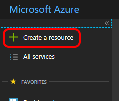
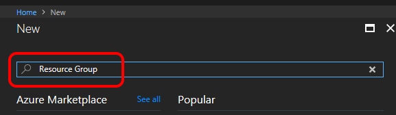
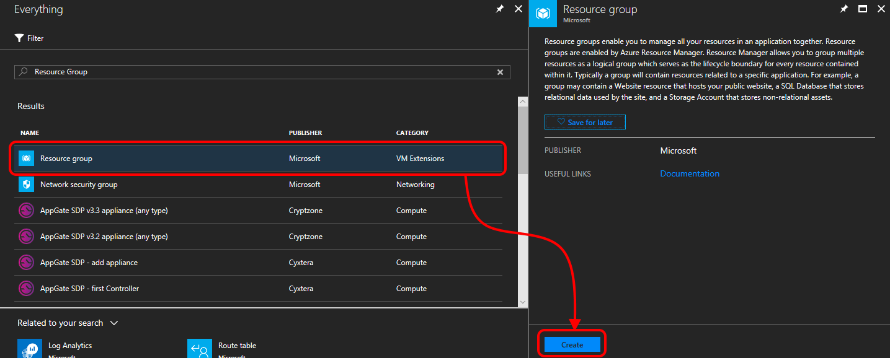
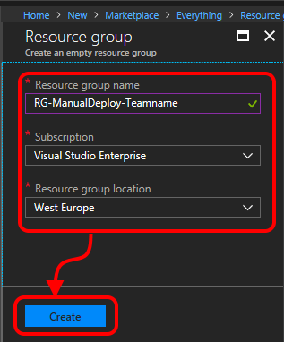
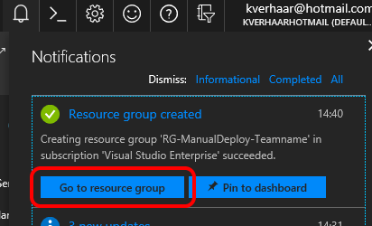
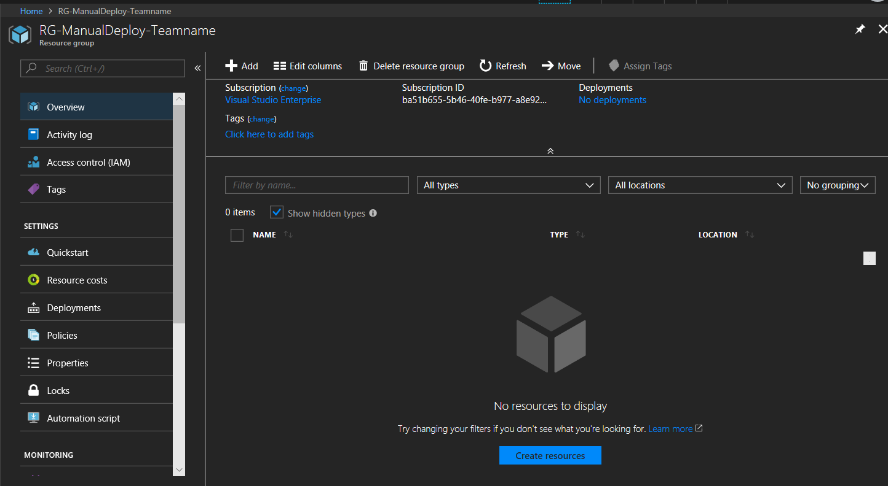
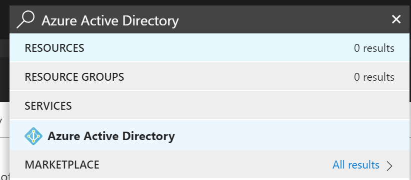
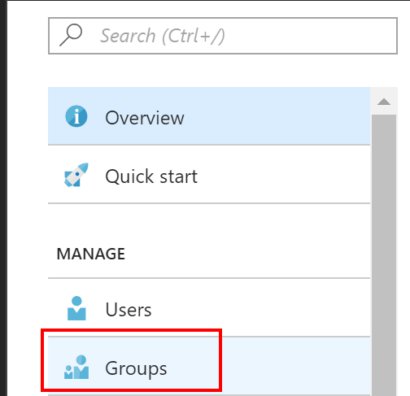
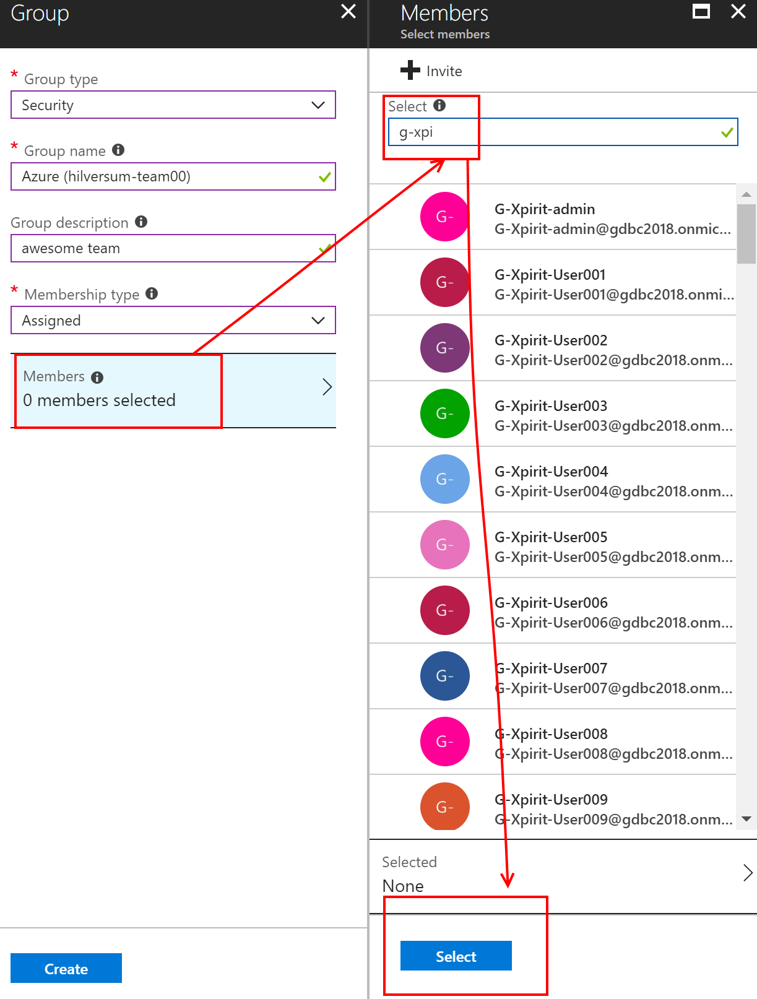
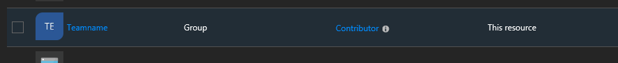

# Step By Step: Manually Set up Resource Groups for initial deployment of the web application #

## Creating a resource group ##
1. Open the Azure Portal by navigating to [https://portal.azure.com](https://portal.azure.com)
2. Click "Create a resource"

3. In the search box, search for "Resource Group"

4. In the search results, click "Resource group" and then click "Create"

5. Enter the resource group name, select your subscription and select the location closest to you as Resource group location. Then click "Create".

6. After a little while your resource group will be created. Click "Go to resource group" to open it.

7. You will see that your freshly created resource group is empty.

## Create security group and add members to security group ##
1. In the Azure portal navigate to the Azure Active Directory blade

2. In the blade, select Groups

3. Press the + button to create a new security group
4. Create a group call Azure (teamname). Select as Group type "Security"
5. Select Members in the same blade 

6. Once the group is created, select "Members"
7. Press the + Add Members button
8. Search for "g-venue-" and select the members from your team and save the group

## Assign security group to resource group ##
1. Find your Resource Group e.g. use the Search box
2. In your resource group, click "Access control (IAM)", click "Add", select "Contributor" for the role and find your team through the search box.

3. Select your team and click "Save". You should see your team being added as "Contributor" specific for this resource.

