# Step By Step: Add Azure Web App and SQL Server to the resource group #

## Creating a Web App ##
1. Go to your newly created resource group and click "Create resources"

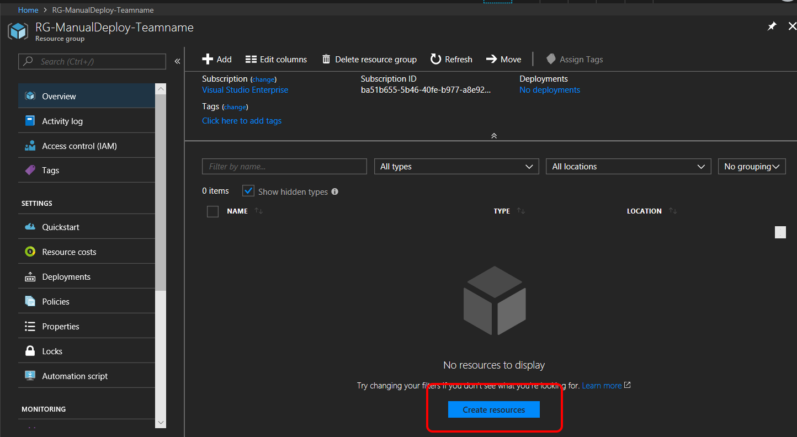

2. Search for "Web App", select it and click "Create"

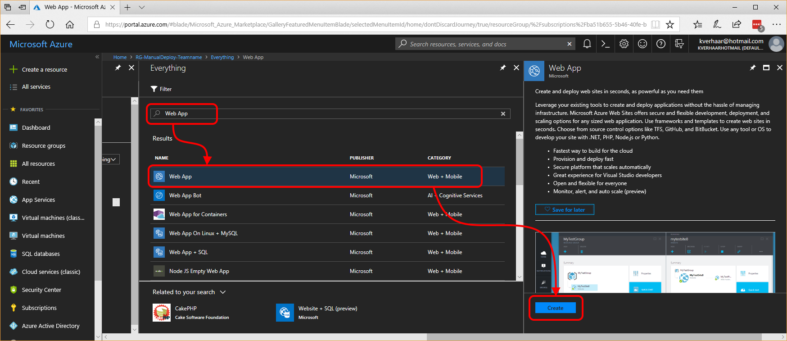

3. Enter a name for your new Web App, create a new App Service Plan for it, make sure you turn on Application Insights and click Create

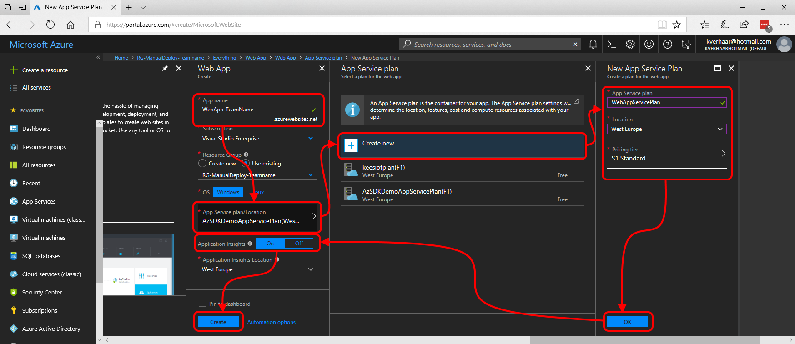

4. After some time you will get a notification that creation of the web app was successful

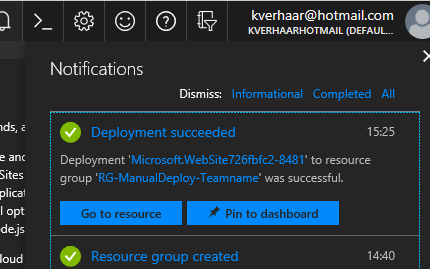

## Create a SQL Database ##
1. Go back to your resource group (which now has the web app in it) and click "Add"

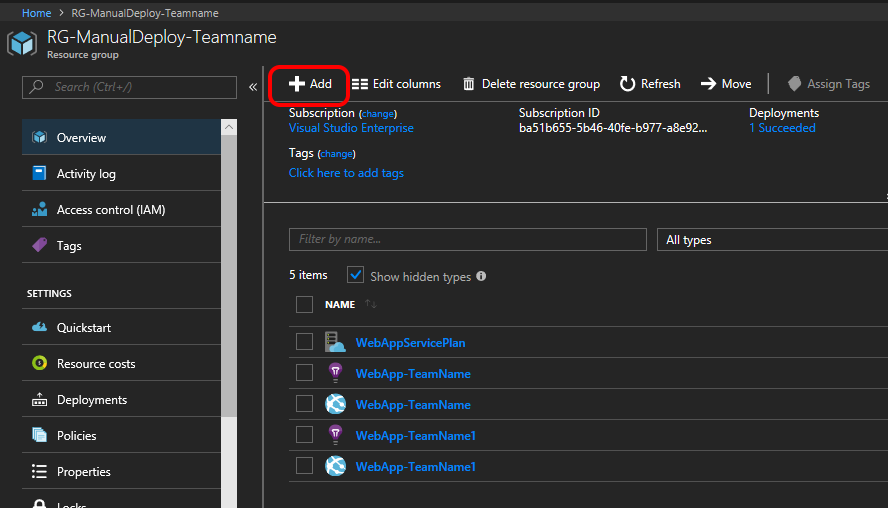

2. Search for "SQL Database", click "SQL Database" and then click "Create"

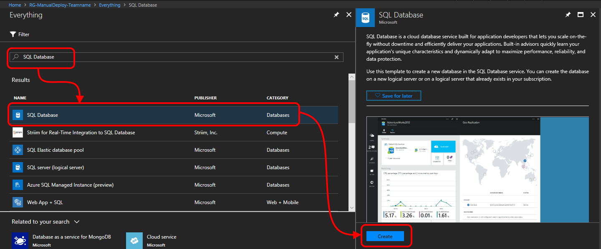

3. Type a name for your database, select "Blank database" as source and configure a new server with admin credentials that will hold the database. Make sure you create a complex password, minimal 10 characters, and write down for later usage!

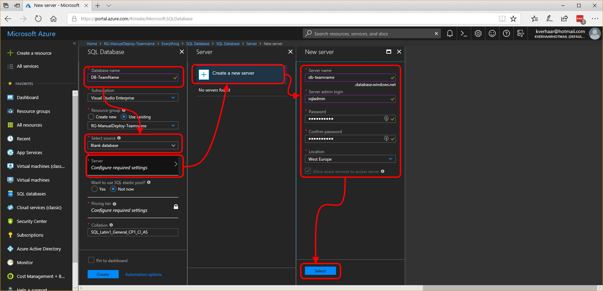

4. Change the "Pricing tier" to "Basic" and click "Apply. Then click "Create"

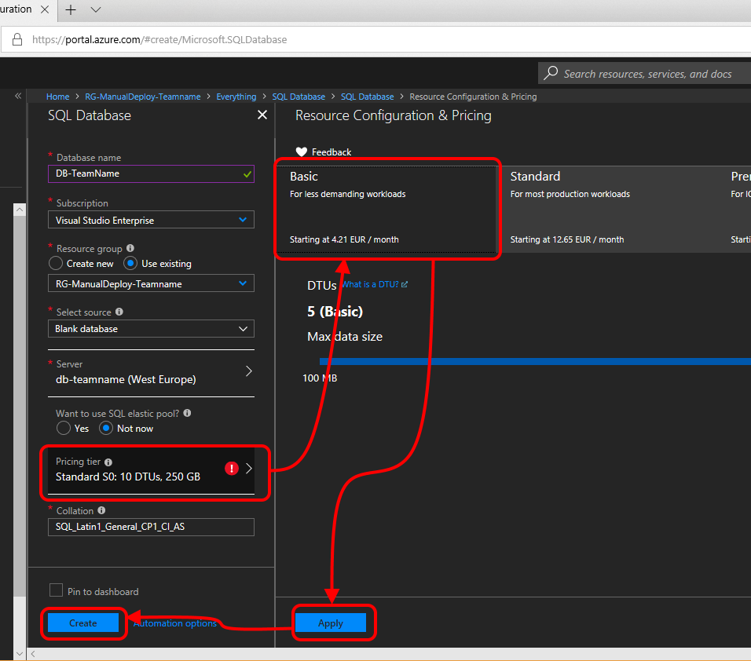

5. After a while, your database will be created

## Creating a database table ##
1. Go to your resource group and click your freshly created database

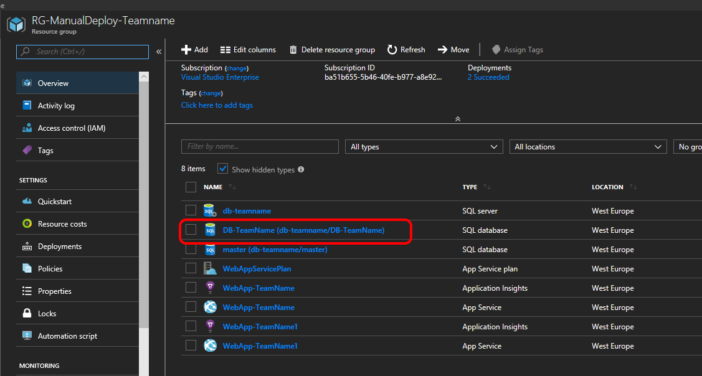

2. Click "Query Editor (preview)" and click "Login". Login using the credentials you provided when creating the database.

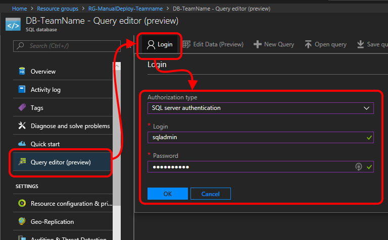

3. Type the following query to create the database table:
`CREATE TABLE TestArtist (
    Id int primary key,
    Name varchar(255) not null
)`
4. Click "Run" to run the query. The query should succeed.

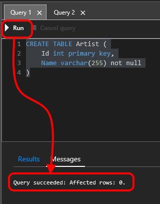

5. Click the refresh button and you should see the new table with a primary key column "Id".

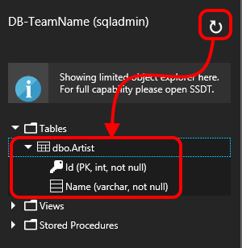