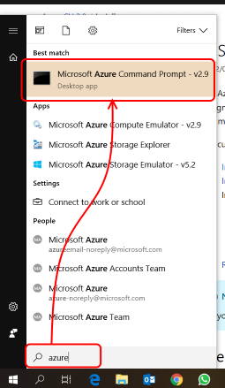
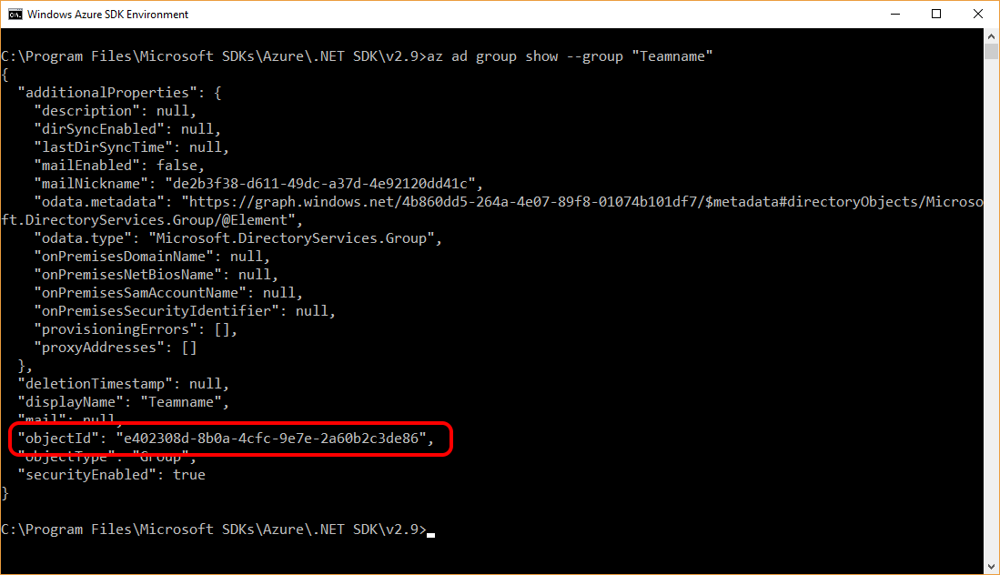

# Step By Step: Automate Resource group creation and Security Groups assignment
This step by step guide describes the steps for automatically creating a resource group and assigning a security group by using the Azure CLI 2.0. If you want to use PowerShell, you'll need to convert all the steps to their PowerShell equivalent.

## Retrieve the ObjectID of the security group
1. Start the Microsoft Azure Command Prompt on your computer



2. Run `az login` and follow the instructions
3. Get the name of the Security Group you created in the first challenge, use as Teamname below
4. Run `az ad group show --group "Teamname"` and make note of the objectID in the result. 



## Creating the script
1. Open up your favourite editor (we're using [Visual Studio Code](https://code.visualstudio.com/)) and create a new file.
2. Save it as `CreateResourceGroup_Fixed.cmd`
3. Add the following code to create a resource group: 

   ``` bash
   REM create resource group
   call az group create --name "RG-Playground-Teamname" --location "West Europe"
   ```

4. Then add the following lines to add the security group "Teamname" as contributor

   ``` bash
   REM assign security group
   call az role assignment create --role Contributor --assignee-object-id "<objectID of group>" --resource-group "RG-Playground-Teamname" 
   ```
   
   Replace `<objectID of group>` with the objectID that you retrieved in one of the previous steps, using the `az ad group show` command.
5. Save your file

## Running the script
1. Switch back to your Azure Command Prompt. If you accidentally closed it, re-open it and login by running `az login`
2. Navigate to the directory where you saved your script by typing `cd <path where you saved your script>`
3. Run `CreateResourceGroup_Fixed.bat`
4. Check the Azure Portal to see that your resource group has been created and the correct security group was assigned.

## Finished script
1. The finished script is in the zip file [CreateResourceGroup_Fixed.zip](.attachments/CreateResourceGroup_Fixed-2098d907-f3bf-4b97-8ce9-c24fd7f00506.zip). Make sure to replace the objectID of your security group before running it. 
