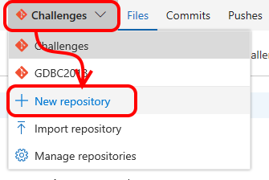
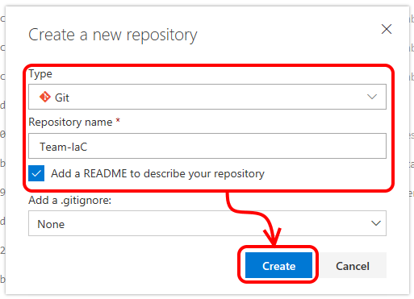
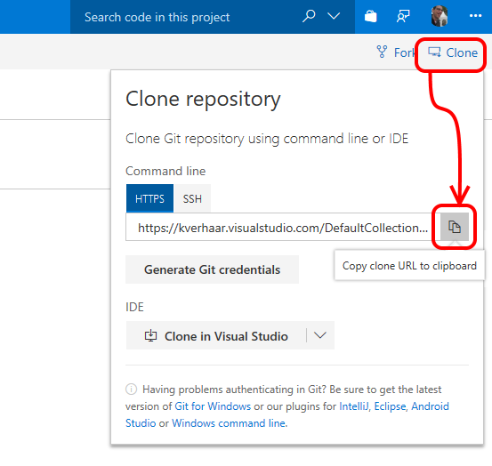
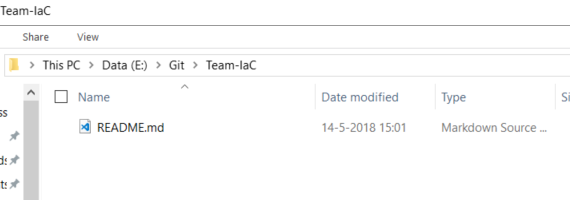
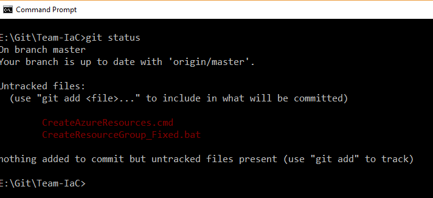
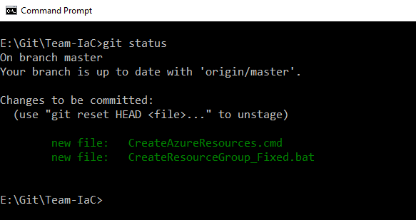

# Step By Step: Move the automation scripts to git version control

## Install Git for Windows
You will need Git for Windows to interact with Git on VSTS from your laptop. Download and install it from [here](https://git-scm.com/download/win) if you haven't done so already (VM already contains Git).

## Creating a Git repository
1. Navigate to VSTS and select your project [https://globaldevopsbootcamp.visualstudio.com](https://globaldevopsbootcamp.visualstudio.com)
2. Navigate to the "Code" hub
3. Create a new repository

4. Select "Git" as the type, enter the correct repository name and enable the checkbox to add a default Readme file. We will not add a .gitignore file for now. Then click "Create"

5. The repository is created and you will be taken to the repository page. Click "Clone" at the top right and then copy the clone URL.

6. Open a command prompt and navigate to the directory where you want to place the local copy of the repository
7. Execute `git clone <clone URL>`. Your repository will now be cloned locally. 
8. Check the contents of the directory. If all is well you should see the default Readme file. 

9. Go back to the command prompt and set the default user name and e-mail address by executing `git config --global user.email "you@example.com"` and `git config --global user.name "Your Name"`.
Replace the email and name values with the VSTS credentials provided by your venue organiser.

## Commit scripts to Git
1. Open your locally cloned Git repo in Windows Explorer
2. Copy the scripts that you created into this directory: `CreateResourceGroup_Fixed.bat` and `CreateAzureResources.cmd`
3. Open a command prompt and navigate to your local repo directory
4. Execute `git status`. You should see the two scripts as "untracked files"

 

5. Execute `git add CreateResourceGroup_Fixed.bat` and `git add CreateAzureResources.cmd`.
6. Execute `git status` again. You should now see your two scripts as "Changes to be committed"

7. Execute `git commit -m "Added scripts for creating resource group and resources"`. Your changed will now be committed with a descriptive commit message.
8. Execute `git push`. This will push your local commits to the repository on the server, so in this case to VSTS.
9. Look at the repository page in the VSTS web interface (you might need to refresh your browser). You should see the files you just added there.

