# Step By Step: Setup Continuous Delivery #

## Create Service Endpoint ##
To deploy our application towards Azure we need to have a service endpoint to be able to connect to Azure from VSTS. 
In your project there is a Team Administrator available. This account can be used to register the service endpoint. The following steps guide you through the process. 

### Create service principal
1. Verify if your machine is Azure PowerShell ready by running the following command

2. You are good if you see similar output

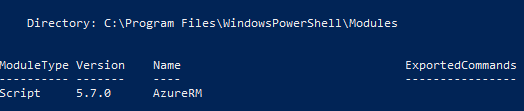

3. If not, please follow instructions here to configure this: https://docs.microsoft.com/en-us/powershell/azure/install-azurerm-ps?view=azurermps-5.7.0
4. Download and run this PowerShell script in an Azure PowerShell window https://github.com/Microsoft/vsts-rm-extensions/blob/master/TaskModules/powershell/Azure/SPNCreation.ps1.
Keep the values listed at the bottom available as well as the password you have choosen.

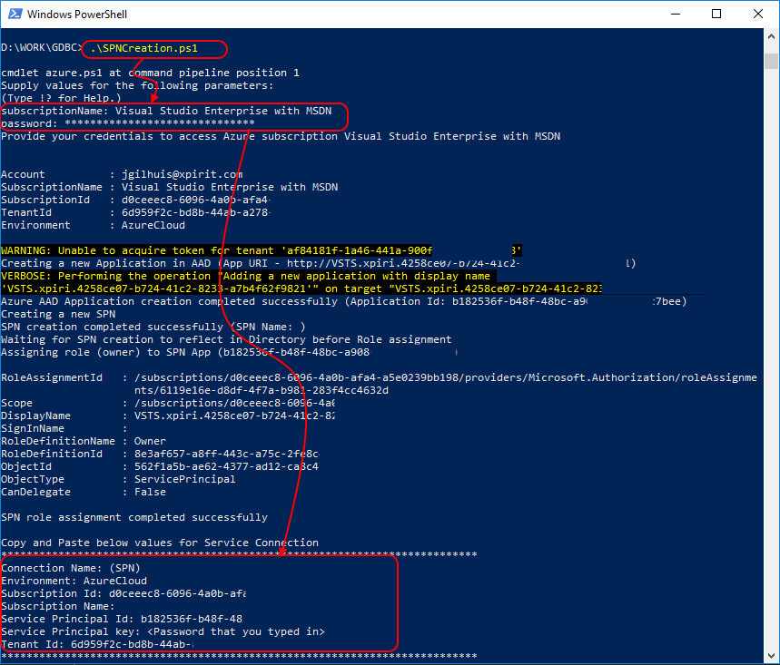

**Note:** some values have been modified in this screen, like subscription name

### Setup Permissions
1. Navigate to the Project Admin Page in VSTS by clicking on the gear icon.
2. Click on the Security tab
3. Navigate to the Endpoint Creators Group
4. Add your Team or Teams' users to the Group

### Create Service endpoint
1. Navigate to the Services Admin Page in VSTS by clicking on the gear icon.
2. Click on the Services tab
3. Choose to create a "New Service Endpoint" of type "Azure Resource Manager"

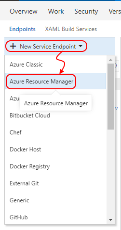

4. From the dialogue choose to use the full version of the dialogue by clicking the highlighted link

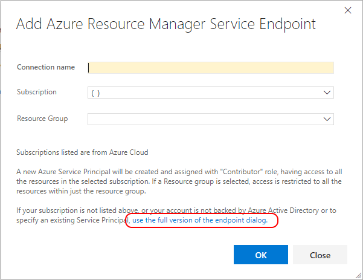

5. Fill in the dialogue

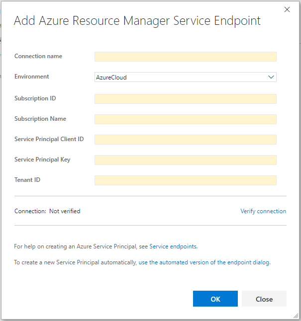

6. Enter the desired connection name e.g. **GDBC Team X**
7. Choose **"Azure Cloud"** as your environment
8. Enter your **Subscription ID**, copy from the script results
9. Enter your **Subscription Name**, copy from the script results
10. Enter your **Service Principal Client ID**, copy from the script results
11. Enter your **Service Principal Key**, copy from the script results
12. Enter your **Tenant ID**, copy from the script results
13. Verify your connection by clicking the "Verify Connection" link

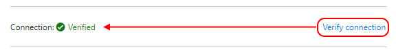

## Create a Release Definition ##
1. Navigate to VSTS and select your project
[https://globaldevopsbootcamp.visualstudio.com](https://portal.azure.com)
2. Navigate to the "Build and Release" hub
3. Create a new release definition

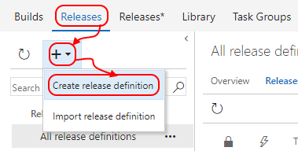

4. Choose the "Azure App Service Deployment" template

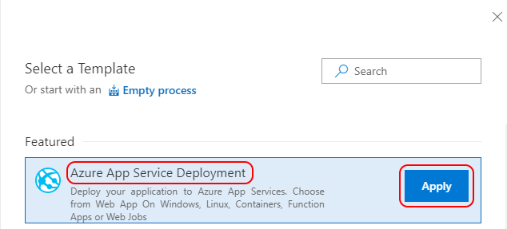

5. Provide a logical name to the environment, e.g. "Release Verification"

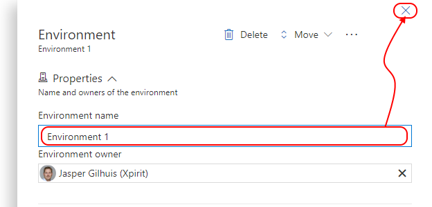

6. Add an artifact to the release 

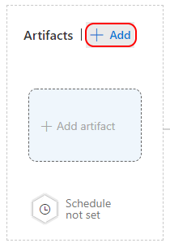

7. Select the source type "Build", the project should be pre-selected, choose the "Source" (Build Definition), and select "Latest" as version. Then provide a logical name, to be able to refer to the Artifact published by the build later. Then choose "Add" to add this artifact.

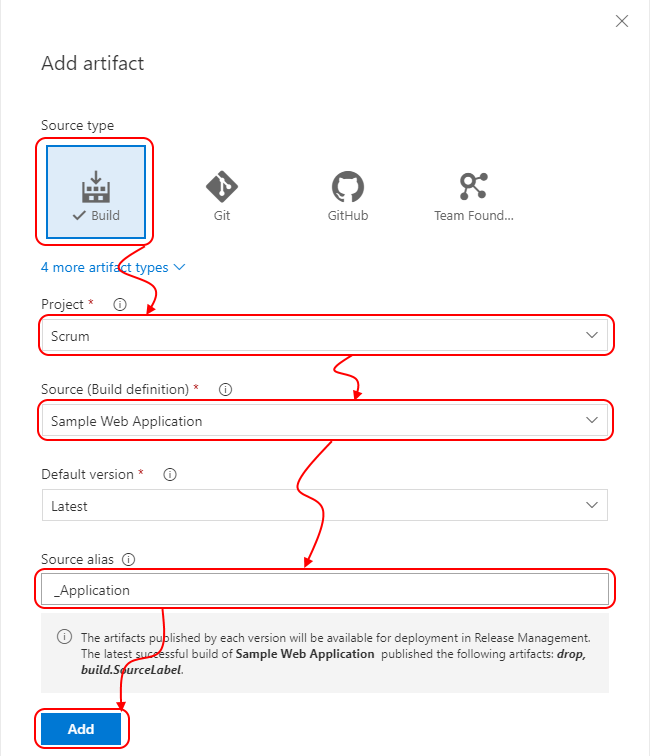

8. Add another artifact to the release, this time choose "Git" as Source Type and then select the correct Source (Repository) as well as the Default Branch and Default version. Then provide a logical name to be able to refer to the Artifact to use in the release later.

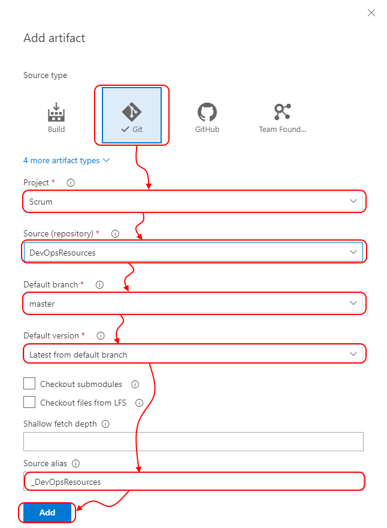

9. For the 'Application artifact' set the "Continuous deployment trigger"

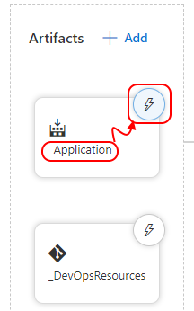

10. Enable the Continuous deployment trigger

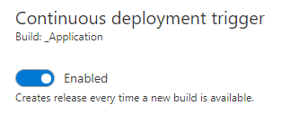

11. Navigate to the "Tasks" tab
12. On your the environment section, choose your azure subscription, and provide a "App Service Name". Choose to use a variable for this e.g. **xjg-webapp-sampleapp**. 

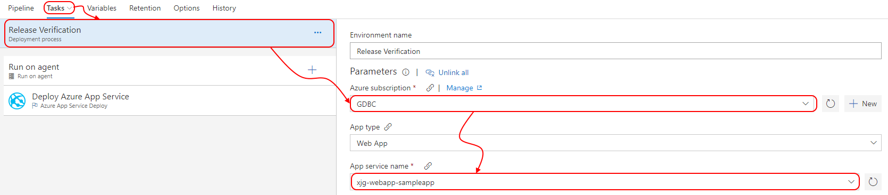

**Note:** The name of your app service name should be globally unique

13. Now select the Azure App Service Deployment task, Verify the details. It should match previous selected items. Notice the Package selection. Click the "..." button to select the our application zipfile. 

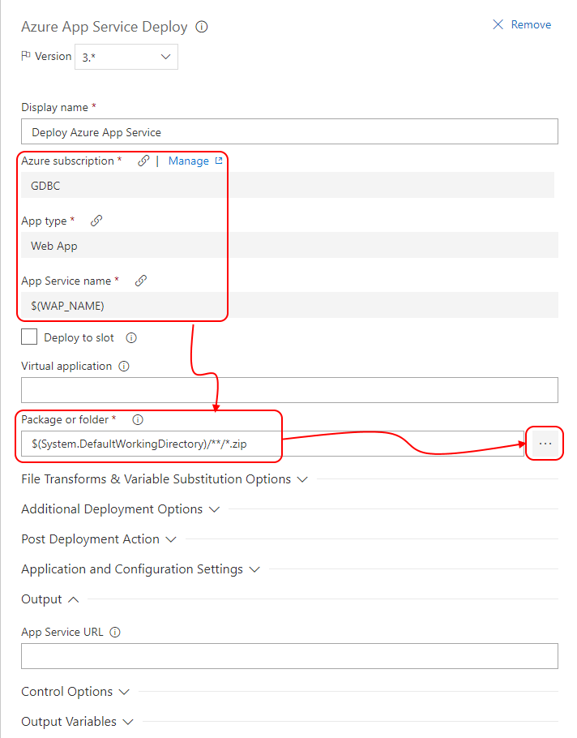

14. Browse to the correct artifact (Build) and select the zip file of our application

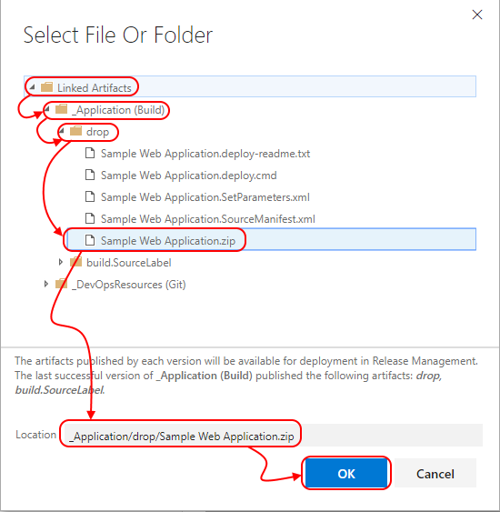

15. Rename your release, and "Save" it

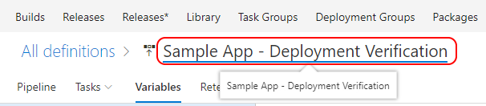

## Create a Azure Web App ##
Now we have a pipeline that would deploy our application towards Azure. But this would fail while we have not created any infrastructure yet. To be able to succeed we are going to add tasks  to our release to provision the Azure Web App to deploy to. We are using our already created batch files. If not created the files are attachted to the workitem.

1. Add the Azure CLI Task to the pipeline

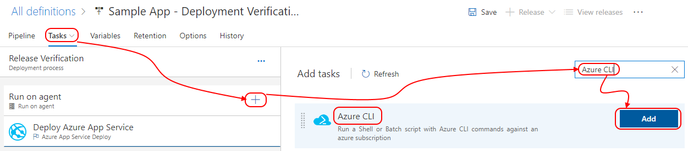

2. Drag it above the "Deploy Azure App Service" task

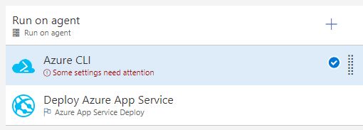

3. Configure the task, select the correct subscription and select the correct deployment script

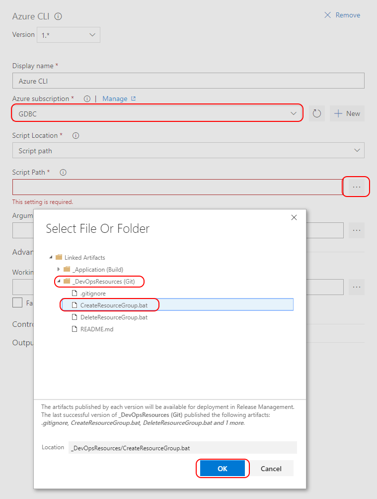

4. The script contains the following content

```bash
REM create resource group
call az group create --name "xjg-rg-sampleapp" --location "West Europe"

REM create appservice plan
call az appservice plan create -g "xjg-rg-sampleapp" -n "xjg-app-sampleapp" --sku F1

REM create azurewebapp 
call az webapp create -g "xjg-rg-sampleapp" -p "xjg-app-sampleapp" -n "xjg-webapp-sampleapp"
```

**Note:** You can specify your own preferred naming here. Note that your WAP_NAME, needs to be globally unique. Region needs to be a valid Azure Datacenter name, use the following link to find the correct values.
[https://docs.microsoft.com/en-us/azure/azure-resource-manager/resource-manager-supported-services]()

6. Now we automated created of a resource group and Azure Web App.

## Remove the Azure Web App
Now that we have the environment being created we also want to remove it after creation to minimize costs.
1. Add another Azure CLI Task to the pipeline
2. Configure the task to run the "DeleteResourceGroup.bat" file. This contains the following script.

```bash
REM delete resource group
call az group delete --name "xjg-rg-sampleapp" --yes
```

**Note:** When the Replace Tokens script runs the variables in this script are also replace while we target ALL *.bat files there. If you specify a specific script there you need to do it twice.

## Run your Release ##
You have now prepared your release to create the needed Azure Resources, deploy your application and remove it and its resources after creation.
1. Queue a new release to see if your release runs.
2. Validate if your CI/CD pipeline is correctly configured by validating if a build runs after a code change, and after successful build, a release is being executed.
