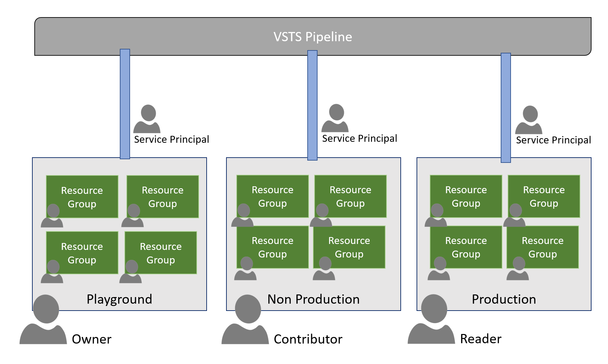

# The move to Azure needs to be secure by design #

## Description ##
Things are moving in the right direction. The development teams are picking up and starting to move faster. Azure usage is growing. But .. With great power, comes great responsibility. The Lead Architect raised some concerns about the current Azure situation. He fears that the road to DevOps will eventually cause havoc amongst Development teams. If they can deploy at will, this will cause failures and there is a high risk of failures.
### ###
To overcome his concerns, the CTO asked him for a solution. This high-level design was the result of this exercise.
### ###

### ###
Developers will get a playground resource group where they can experiment and play. In this resource group, they are *owner*. When moving to Dev and Test environments they will get access to specific resource groups as Contributor. These subscriptions are perfectly suitable to build and break down dynamically. 
### ###
For Staging and Production, they move to a specific Azure Resource Group. In a later stage this can even be a separate Azure subscription. There the development team are merely *readers*. To get software and infrastructure deployed into Azure they must use a Visual Studio Team Services Release Pipeline. The connection from the pipeline to the Resource Group is authenticated by a specific Service Principal with elevated privileges. 
### ###
Pipelines need to be used in all environments and need to be there from the start. To keep all secrets out of Source Control and such, Azure Key Vault will be used to keep the secrets. Each resource group will have a dedicated Key Vault for deployment-specific secrets. Team secrets should be stored in a Team Key Vault.
