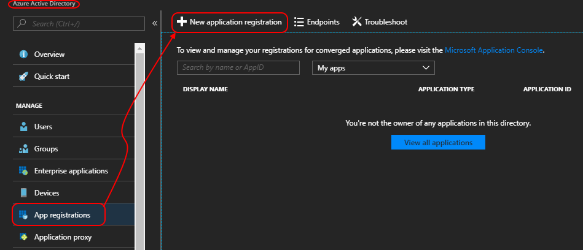
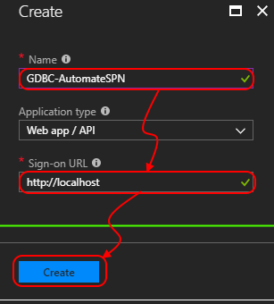
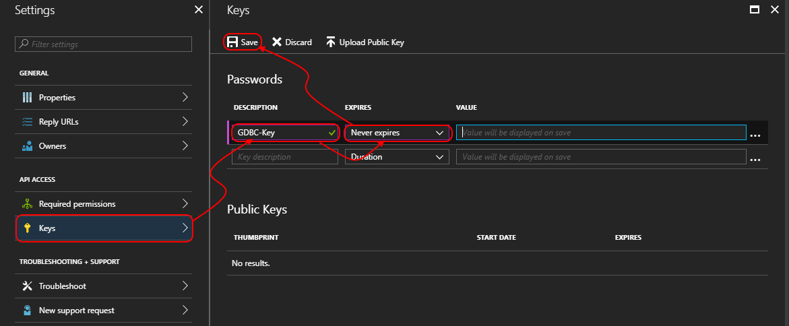
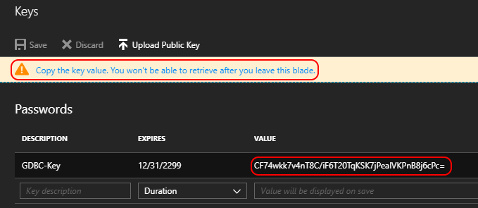

# Step By Step: Set up separate Playground Test and Production resource groups #

## Setup Service Principal ##

1. Navigate to the Azure Portal
2. Login to the subscription (if not already) with the Team admin account
3. Navigate to the "Azure Active Directory"
4. Click "App registrations" and then "New application registration"



5. Enter a name [GDBC-AutomateSPN-Teamname] and the url "http://localhost"



6. Add permissions for the SPN for the "Graph API"


7. Select both permission groups "Application Permissions" and "Delegated Permissions"


8. Confirm by clicking "Done"


9. Add a key



10. Copy the value generated, store this for later usage!



11. Write down and store the following items:
    1. Application Name
    2. Application ID
    3. Object ID
    4. Generate Key (step 9)

12. Open a powershell window, login as Team admin G-venuename-Admin

```powershell
Login-AzureRMAccount
```

13. Get the Subscription ID. Run

```powershell
Get-Azurermsubscription
```

If you see more than one subscription, ask the venue proctor which one to use (likely Azure Pass) and  copy the Subscription ID.

14. Run the CreateResourceGroupForSPN.ps1 script (attached to the workitem)

```powershell

.\CreateResourceGroupsforSPN.ps1 -applicationName "GDBC-AutomateSPN-Teamname" -subscriptionid <your subscription id> -resourcegroup "<your resource group name" -location "location"
 ```

You created a resource group and granted rights to the SPN. This SPN you can use later in VSTS.

To get the SPN application ID (later needed), run 

```powershell
Get-AzureRmADApplication -DisplayNameStartWith "name of your application you created in portal"
```

15. Run this script 3 times for all resource groups (Playground, Test, Production)

16. Check in the code to the IaC repo in Git