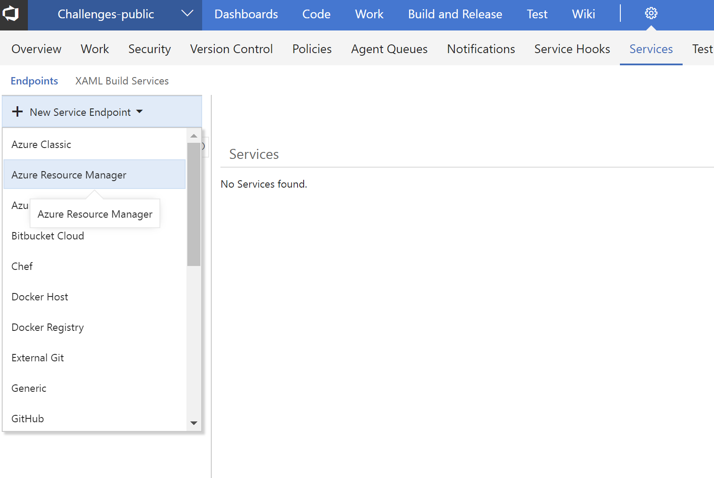
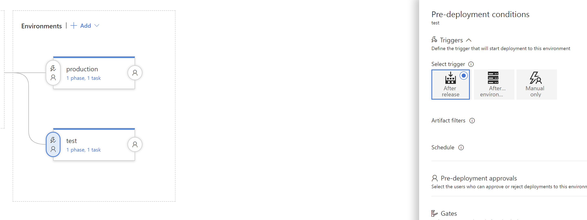
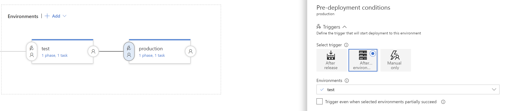

# Step By Step: Extend Release pipeline with new environments #

## Creating a new Service Endpoint for your Resource Groups ## 

1. Login as a Team Admin in your VSTS project and navigate to the admin pages and the _Service_ Tab
2. Add a new Service EndPoint of type *Azure Resource Manager*

3. Use the full version of the Endpoint Dialog, and use the application id and key from the previous achievement. 

## Create a new Release Definition ##

1. Create a new Release Definition following guidance from Challenge 2. This definition should have three environments matching the resource groups previously created. 

2. Each environment will have two tasks. First step is to create the Azure Resources using Azure CLI Task (webapp, sql server, database, firewall), see Challenge 1. Use scripts from the IaC Git Repository. Scripts are also attached to the workitem.

> Make sure you pass two arguments to the provided CreateAzureResource.cmd file in the Azure CLI Task, environment name (dev,test,prod) and resource group name. 

3. Second task is to deploy the Azure Web Application, Azure App Service Deploy Task. 

4. For each Environment in the the Release Definition use the above created Service EndPoint.

You will now have three environments; a dev and test and a production. Optionally you can set pre- and post-approvers so that releases are not automatically pushed to other environments.

> Make sure you adjust the tasks in the Test environments so that they actually deploy to a test environment and not to production.

5. Select the icon in front of the Test environment to edit the Pre-deployment options and set it to be triggered by the build.

6. Do the same for the all the environments, but set this to be triggered by After Environment and select the Test environment.

