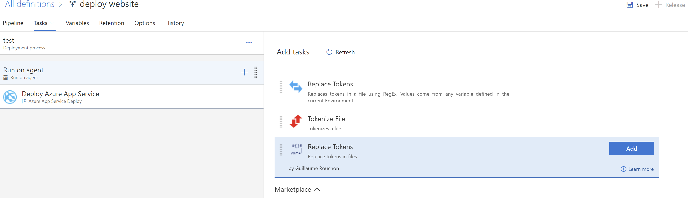
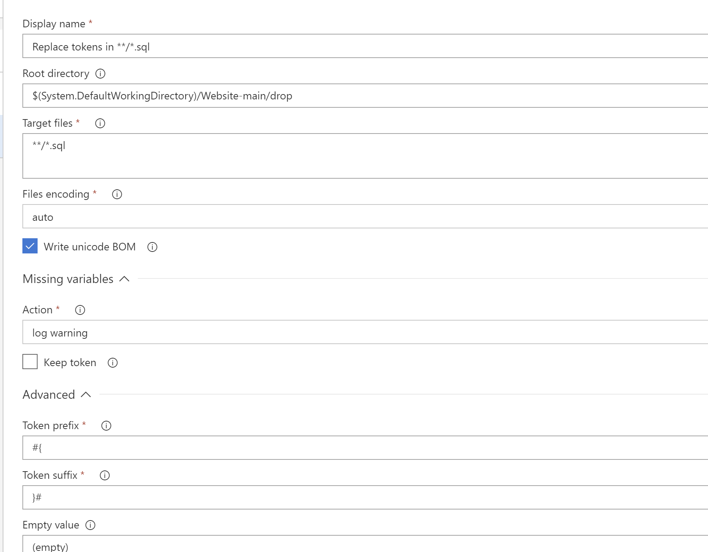
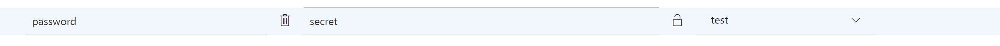

# Step By Step: Use secrets in your pipeline #

1. Open one of your Release Definitions and set it to edit mode.
2. Edit the tasks of the environment where you want to apply the secrets.
3. Part of the files being placed in the sources folder by the TFS agent is your SQL file (you can use the sample.sql as inspiration). You do not want a password to be visible there. 
4. Replace the password in the SQL file with a token named #{Password}#

> Make sure this script is added to your IaC Repository, this approach can be applied to any file containing secrets or dynamic content

5. Add the Replace tokens tasks to the top of the tasks.

 

6. Configure the task settings so that it points to your SQL file where you want to replace the values in.

7. Under the variables tab, add a new variable with the same name as the token (password) you want to replace.

The next time you run this release definition, the task will replace the token with the value from the variables list. A variable can be marked as secret, which makes sure it is not directly visible, both to users as in logs.
