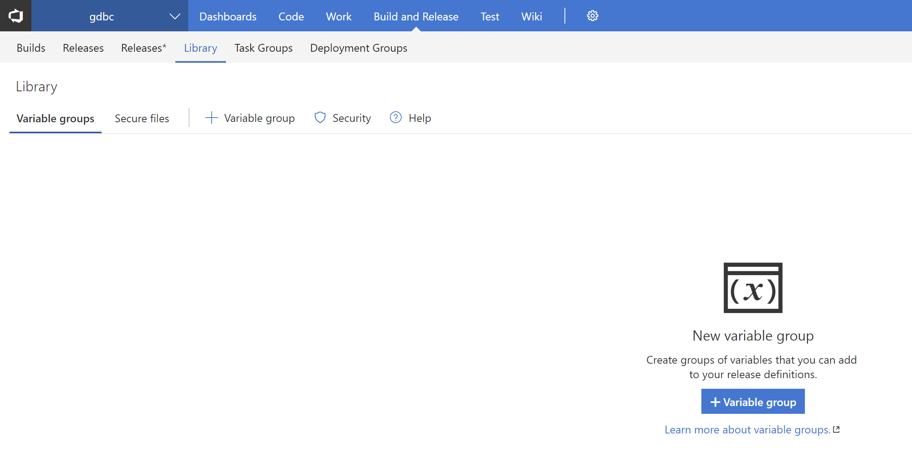
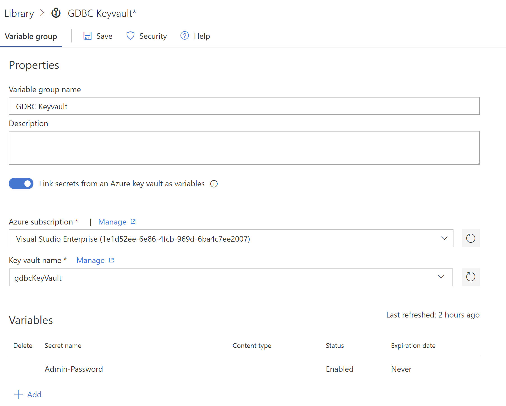

# Step By Step: Create a keyvault in your resource groups #

1. Open the *Create.bat* file which contains the basic instructions using the AZ CLI.
2. Execute the contents of this file and replace the resource group with the ones you created before. Do this for all the resource groups you have.

> To get all the resource groups available run the following command; az group list

3. Go to the Variables tab and add a new Variable Group.

4. Indicate that you want to link the secret from an Azure Keyvault and select the Keyvault you created. When the connection is made, you can add the secrets to the variables.

> Make sure you select the correct Azure Subscription and Keyvault name

5. Link the variable group in your release defintion

> Make sure that the Password variable name matches the name in the Keyvault