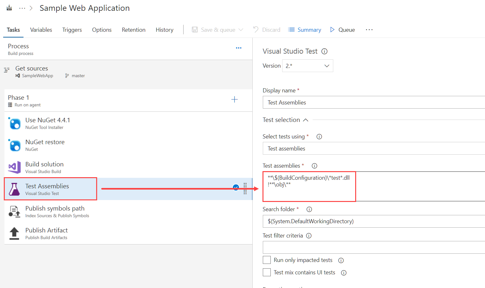
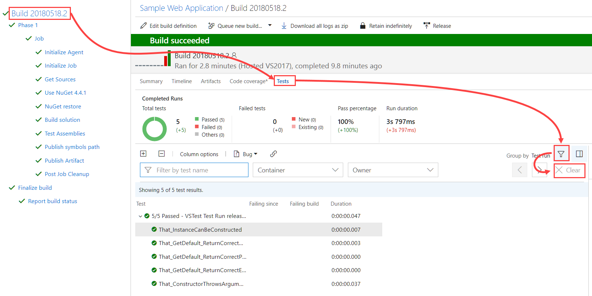
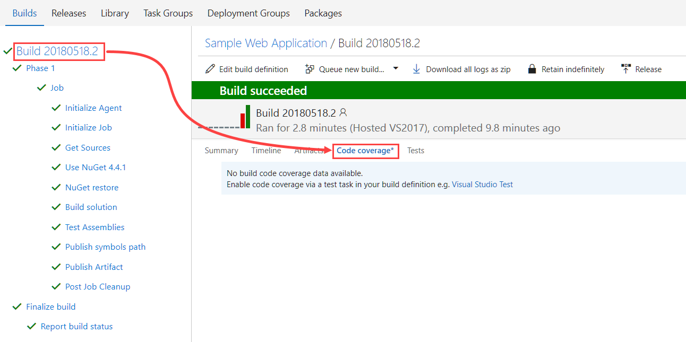
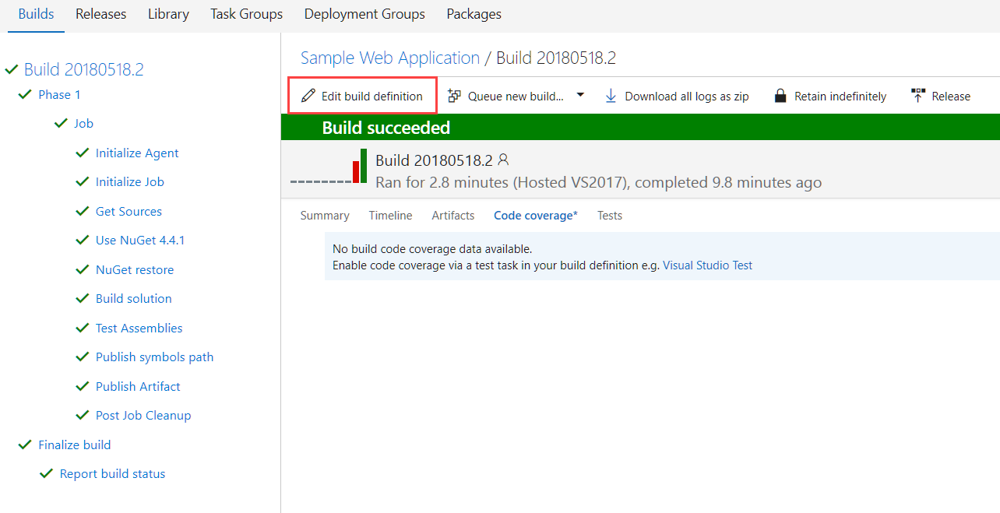
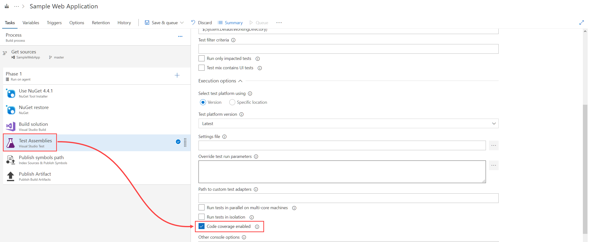

## Setup unit tests and code coverage in CI build

1. Open the CI build you setup in `CH002-AC002`
2. Select the "Test Assemblies" step, review the settings. They should be like this:

3. Press "Save & queue" if you made any changes else press "Queue".
4. Wait for the build to complete.
5. Inspect the test results:

6. Inspect code coverage results:

As you can see there are no coverage results yet. We first need to enable this in the build
7. Press "Edit build definition":

8. Select the "Test Assemblies" step, scroll down a bit and select "Code coverage enabled":

9. Press "Save and queue".

## Inspect test results and coverage
10. Wait for the build to complete
11. Go to the summary page and inspect the results and coverage:

