# Step By Step: Protect your master branch with Pull Requests #

1. Open the Branch policies for the master branch in your repository:

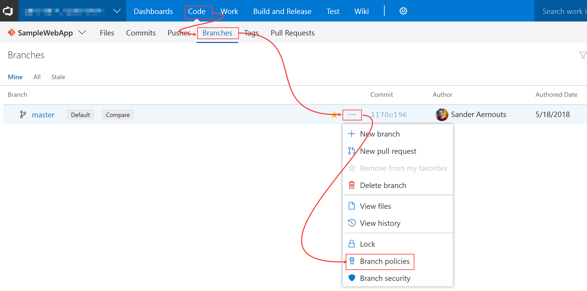

2. Configure the required policies:

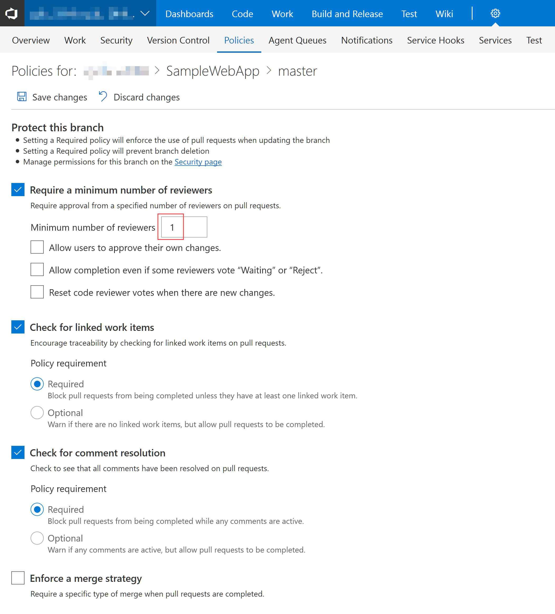

3. (Optional) Configure build validation :

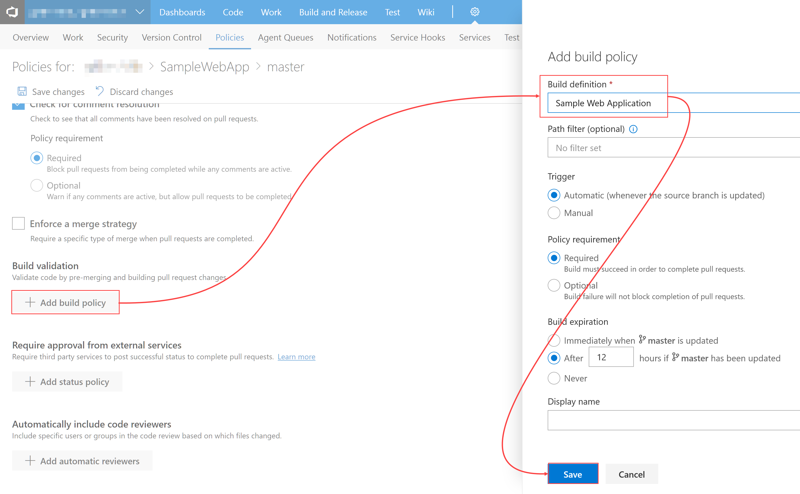

4. Press "Save Changes"
5. Navigate back to the repository, you will now see branch policies have been activated on the master branch:

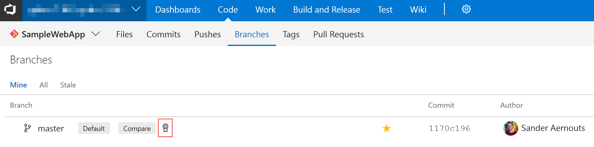

This means no code can be pushed directly to master anymore. You will have to setup a branch and submit a pull request to make any changes.

## Make a change using a pull request
6. Open a command prompt and change directory to the repository on disk, for example: `c:\repots\gdbc\samplewebapp`
7. Run the following commands:

```bash
git checkout master
git pull
git checkout -b feature/awesome-feature
```

8. Make a change in your code that breaks at least 1 unit test
9. Run the following commands:

```bash
git add *
git commit -m "added great feature"
git push -u origin feature/awesome-feature
```

10. Go back to your repo in VSTS and create a new pull request:

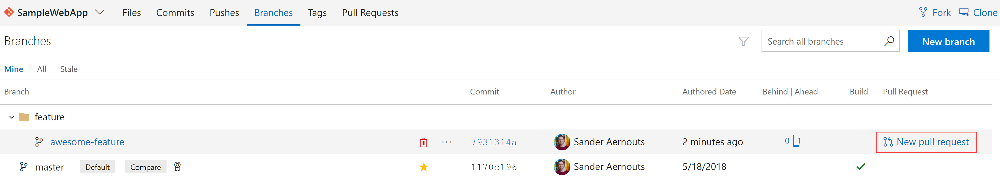

11. Make sure the pull request goes from `feature/awesome-feature` into `master`, add a reviewer that is not you (since you cannot approve your own changes in our current setup) and add the work item you were working on. When you are done press "Create":

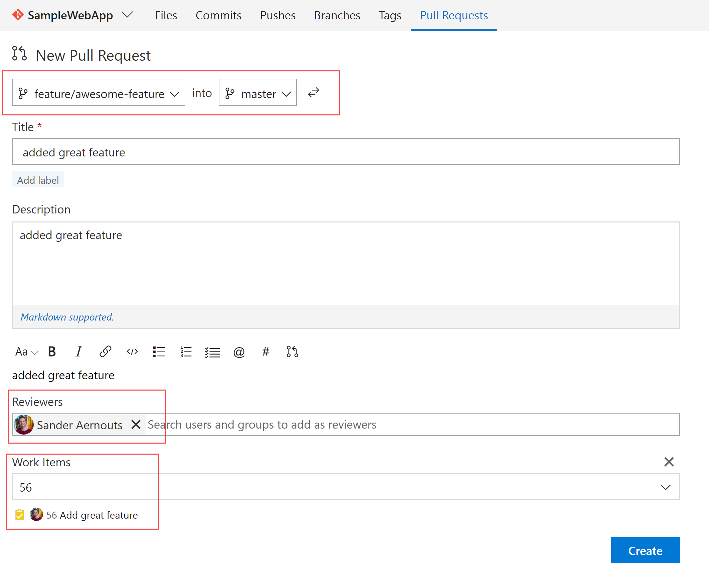

12. Have the reviewer review the changes:

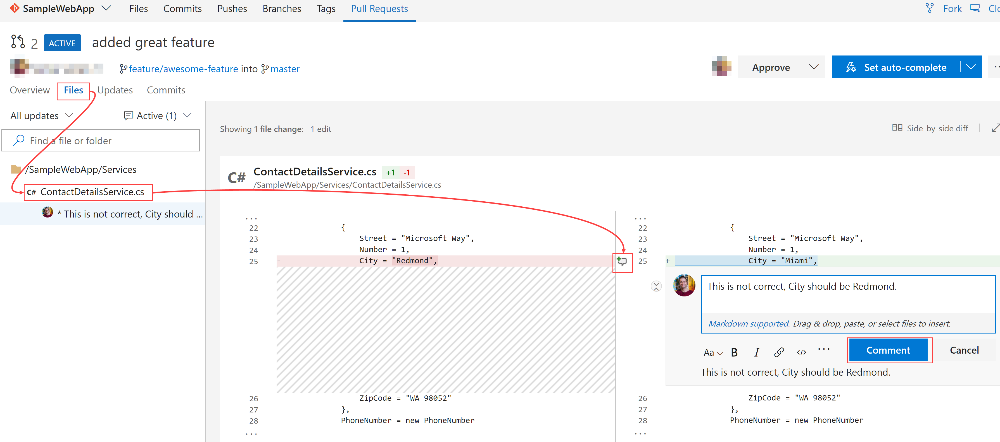

13. Go back to your pull request and you will see you cannot complete it yet:

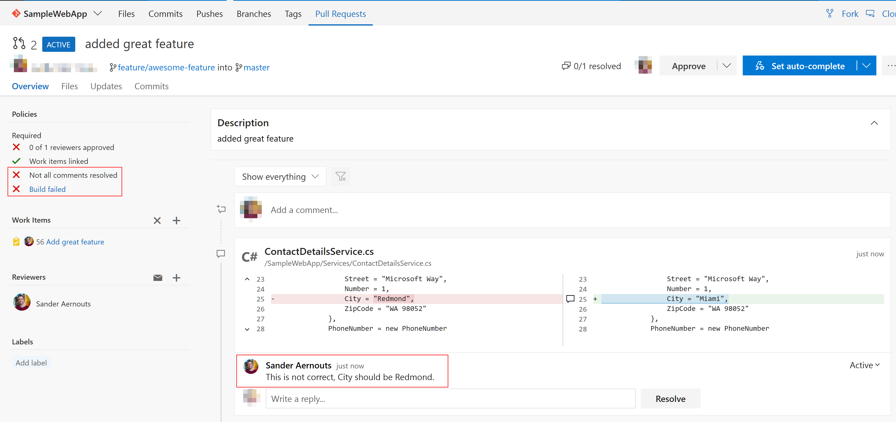

As you can see the build failed (because we broke a unit test on purpose) and a comment was left that must be resolved.
14. Fix the code again in your repository and run the following commands:

```bash
git add *
git commit -m "fixed unit test"
git push
```

15. Go back to your pull request. As you can see the build has automatically been triggered when you pushed the change to the branch. Reply to the comment and resolve it and set the pull request to complete automatically once all policies have been satisfied:

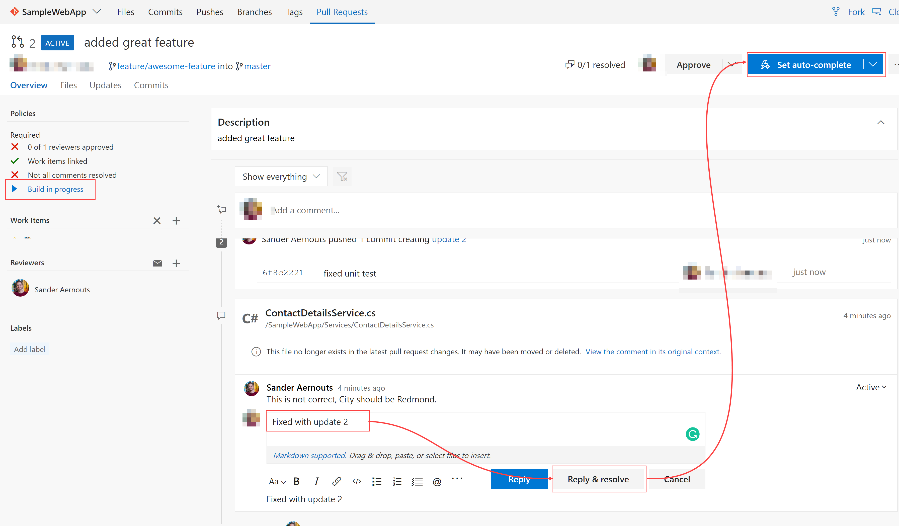

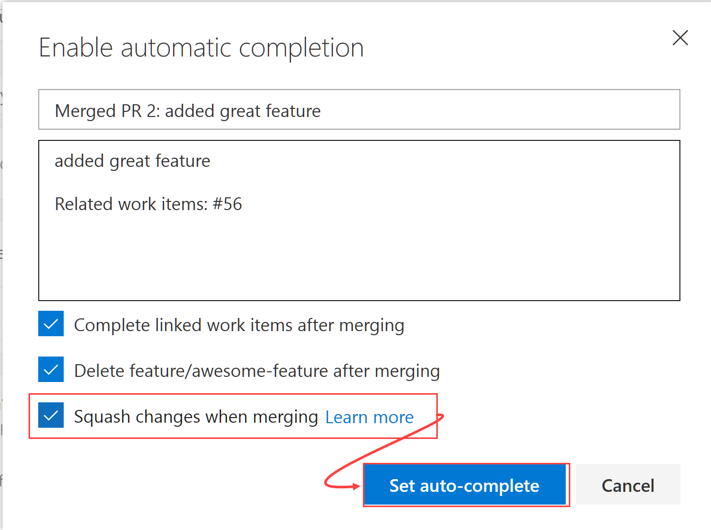

16. Have the reviewer approve the changes:

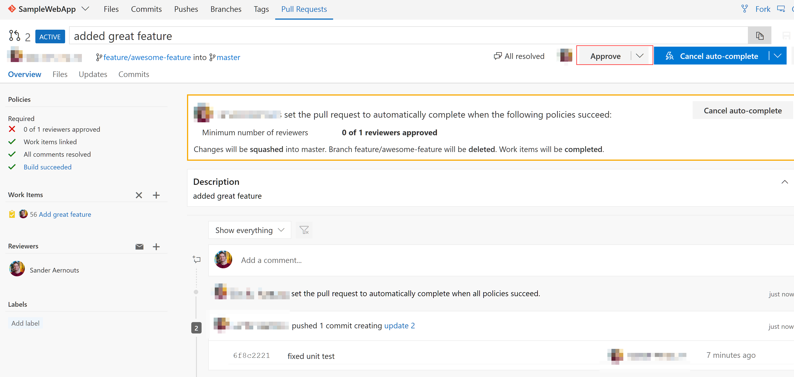

17. Go back to your pull request. wait for your build to complete and you will that the pull request has been completed:

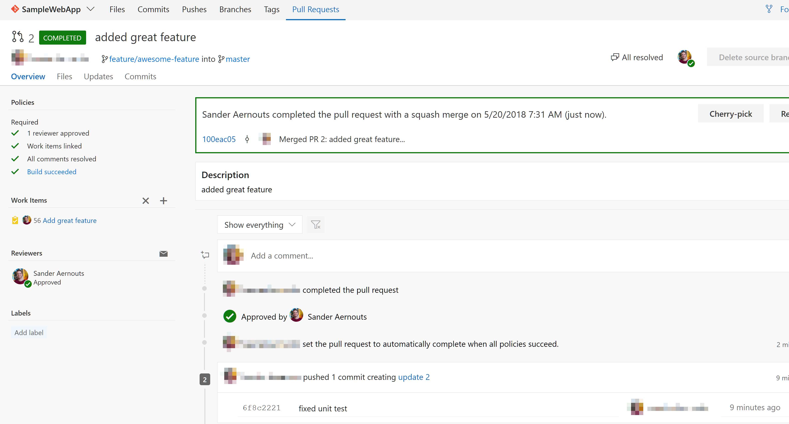

18. Go back to your repository and check the history. You will see a commit that says a pull request was merged to master. Click on the pull request number:

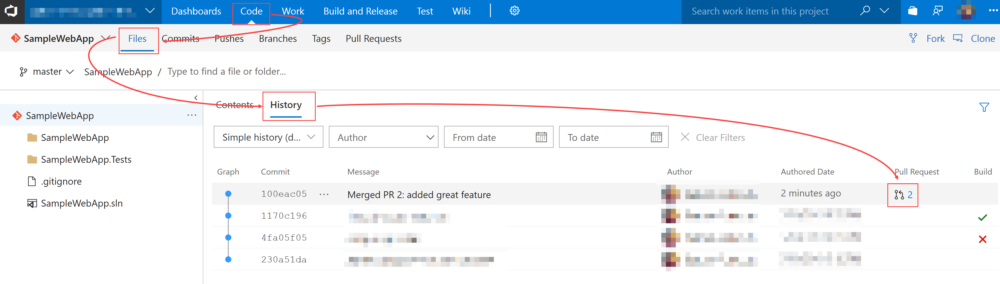

19. There you have it" proof that this pull request was reviewed, approved and met all required policies before it was merged into master!