# Step By Step: Release feature branch to dynamic environment #

1. Open your CI build and click the "release" button:

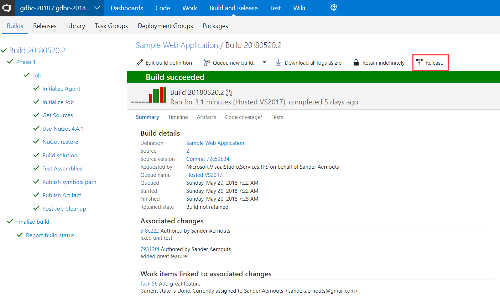

2. Select "Empty process":

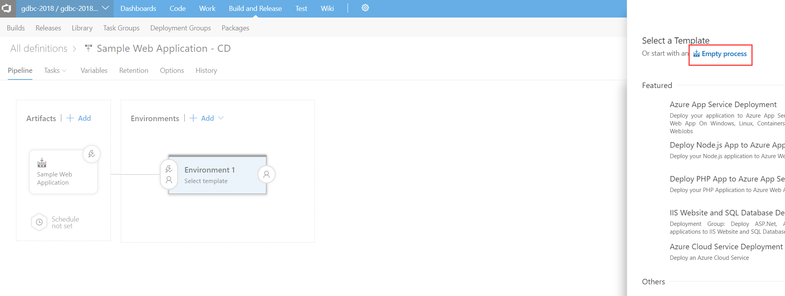

3. Name the environment "Dynamic" and click the "1 phase, 0 task" link

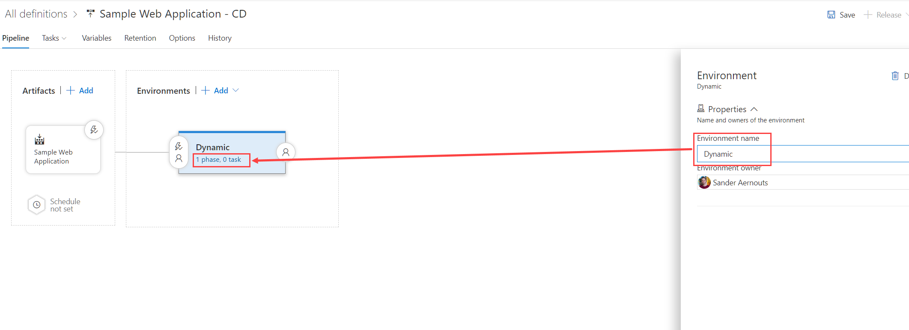

4. Add a powershell task:

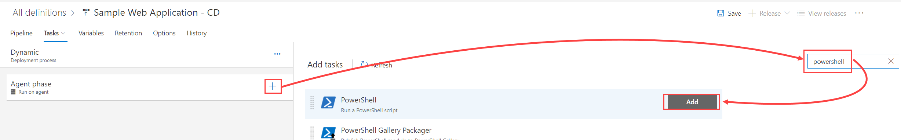

5. Configure it like this:

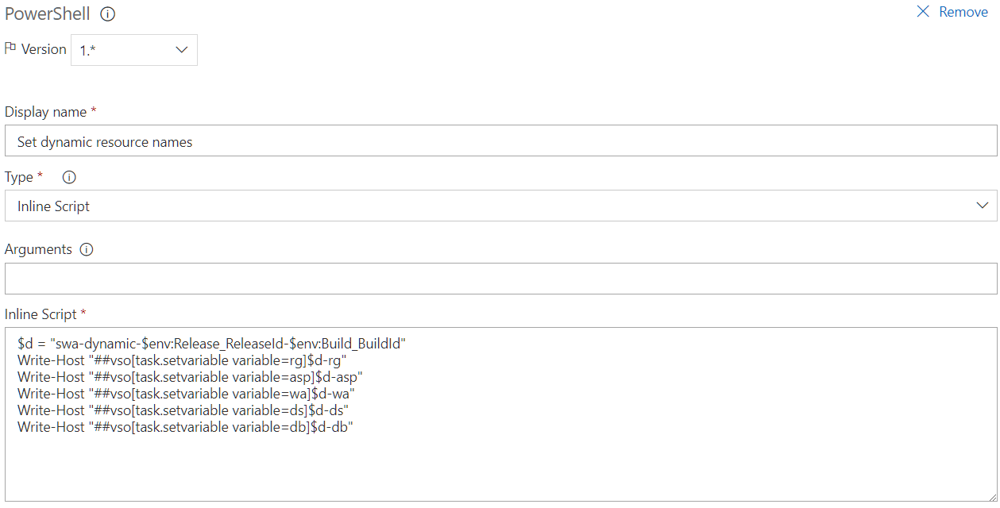

Content of the script box is:

```powershell
$d = "swa-dynamic-$env:Release_ReleaseId-$env:Build_BuildId"
Write-Host "##vso[task.setvariable variable=rg]$d-rg"
Write-Host "##vso[task.setvariable variable=asp]$d-asp"
Write-Host "##vso[task.setvariable variable=wa]$d-wa"
Write-Host "##vso[task.setvariable variable=ds]$d-ds"
Write-Host "##vso[task.setvariable variable=db]$d-db"
```

6. Add 6 Azure CLI tasks (click add 6 times!):

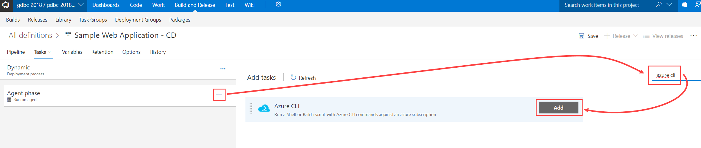

7. Configure the 1st Azure CLI task like this:

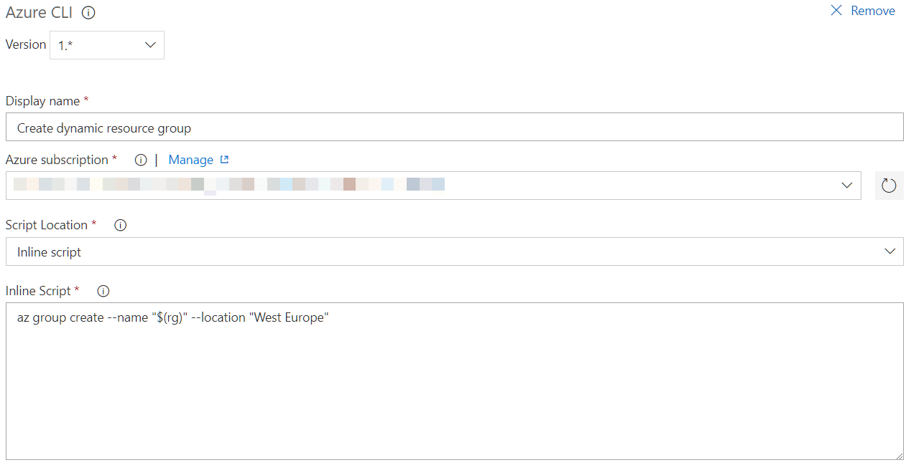

Content of the scripts box is:

```bash
az group create --name "$(rg)" --location "West Europe"
```

8. Configure the 2nd Azure CLI task like this:

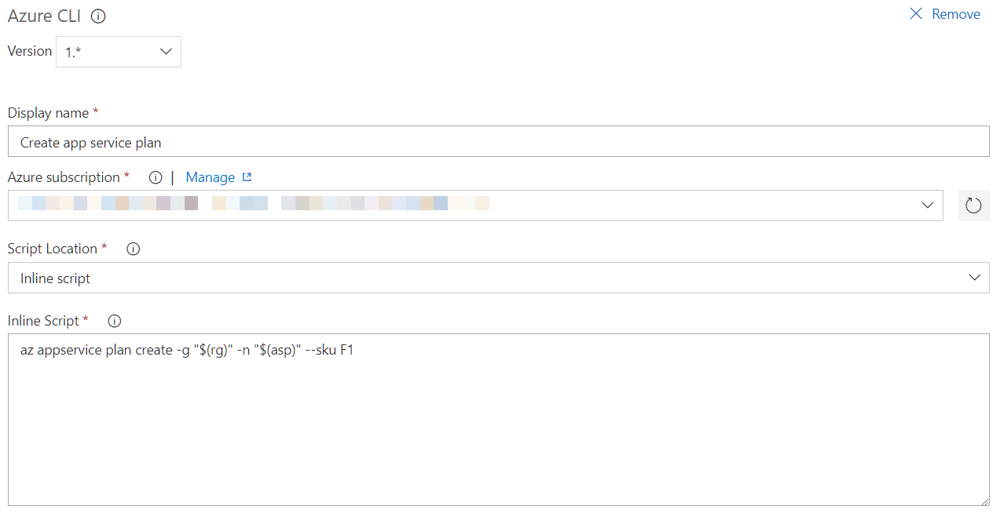

Content of the scripts box is:

```bash
az appservice plan create -g "$(rg)" -n "$(asp)" --sku F1
```

9. Configure the 3rd Azure CLI task like this:

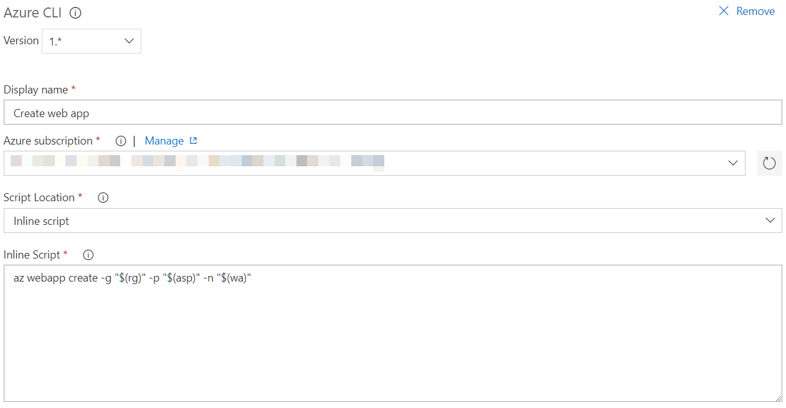

Content of the scripts box is:

```bash
az webapp create -g "$(rg)" -p "$(asp)" -n "$(wa)"
```

10. Configure the 4th Azure CLI task like this:


```bash
az sql server create --admin-password "Welkom123!" --admin-user "GDBCAdmin" --location "West Europe" --name "$(ds)" --resource-group "$(rg)"
```

11. Configure the 5th Azure CLI task like this:

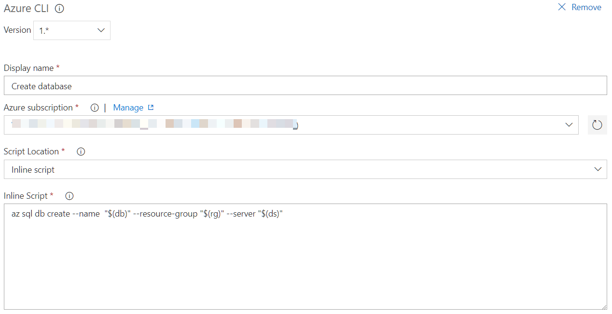

Content of the scripts box is:

```bash
az sql db create --name  "$(db)" --resource-group "$(rg)" --server "$(ds)"
```

12. Configure the 6th Azure CLI task like this (**don't forget the extra highlighted setting in the control options section!**):

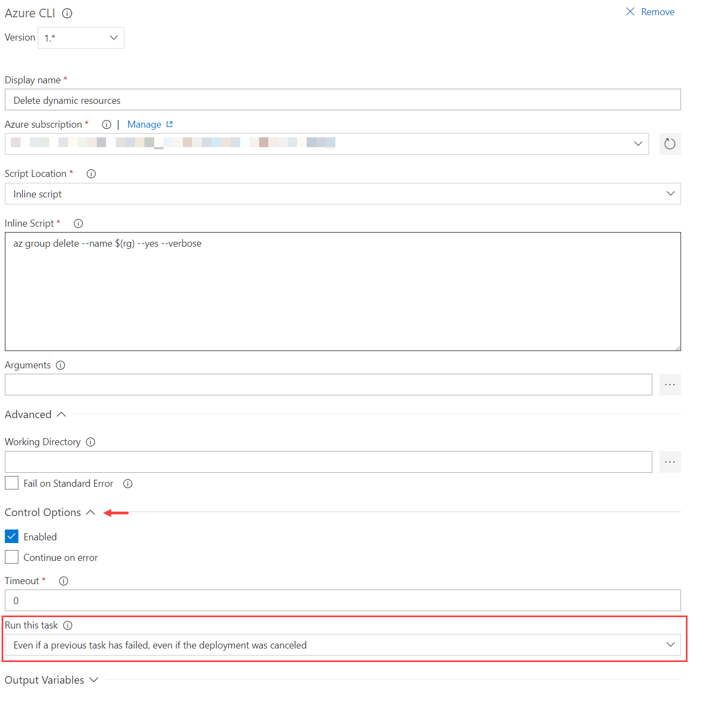

Content of the scripts box is:

```bash
az group delete --name $(rg) --yes --verbose
```

13. Add an "Azure App Service Deploy" task between the last and second last Azure CLI tasks:

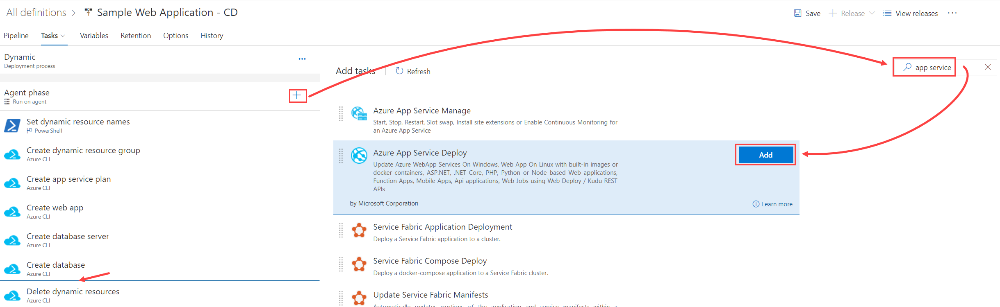

14. Configure it like this:

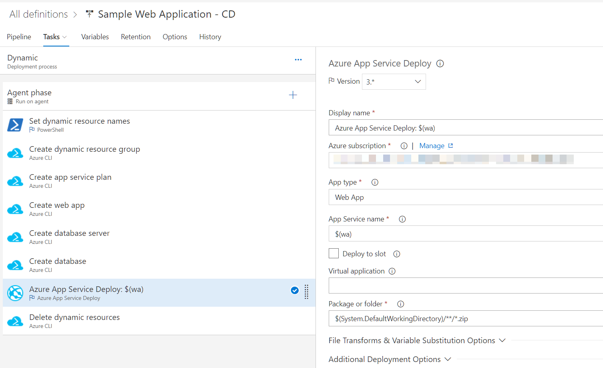

15. Go back to the pipeline view and setup a branch filter for the artifact trigger:

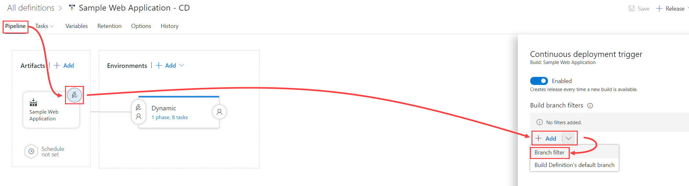

16. Set the value to `feature/*` by typing this:

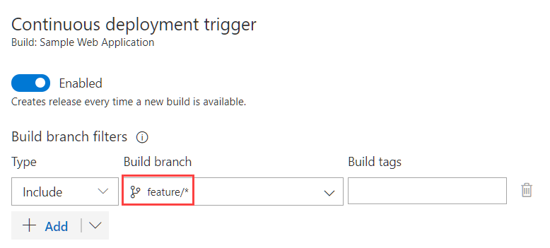

17. Save the release:
18. Queue a release:

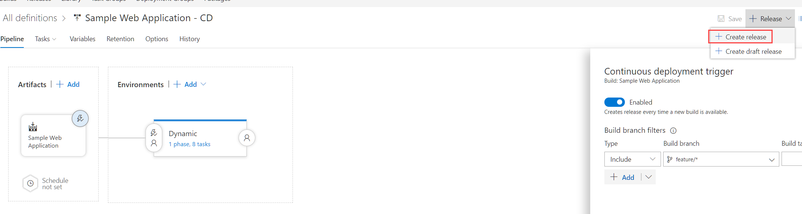

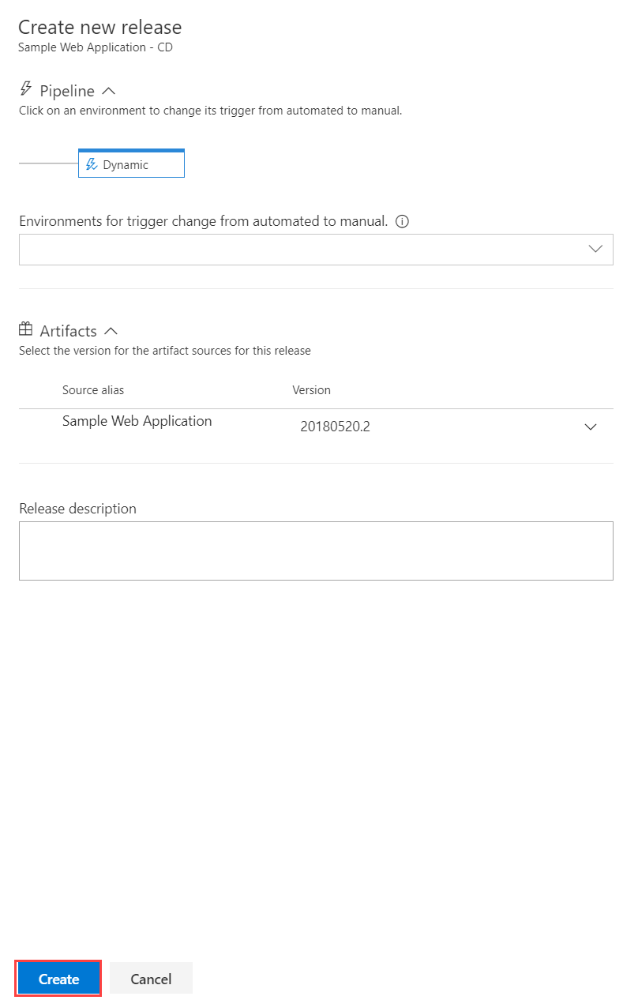

19. View the logs to monitor progress (will take a while since quite multiple resources will be created for you):

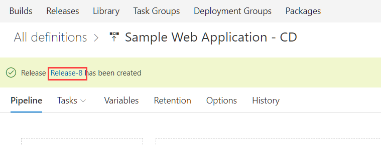


