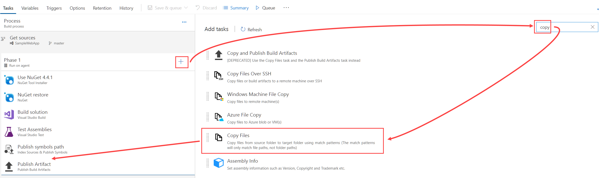
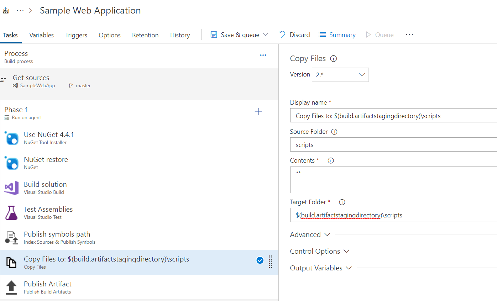
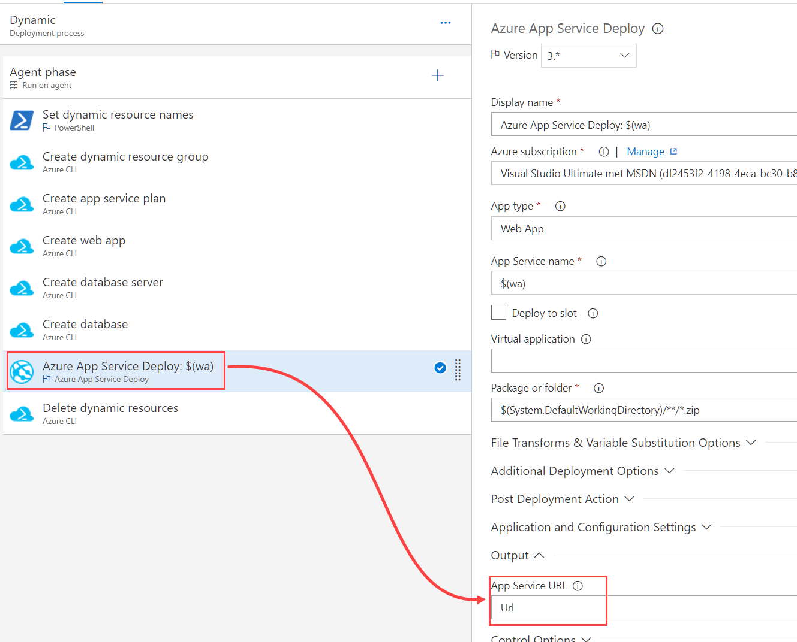
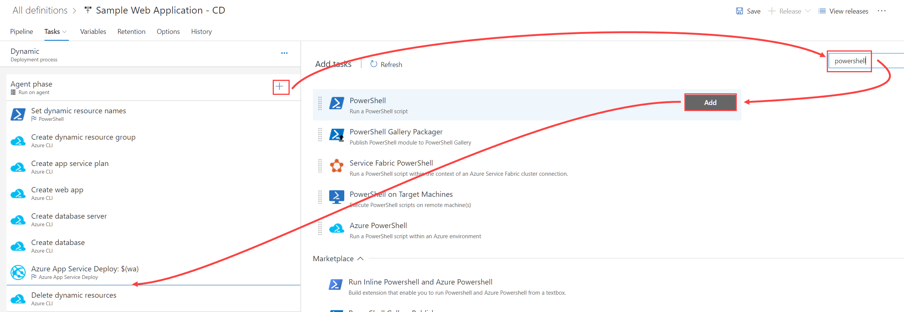
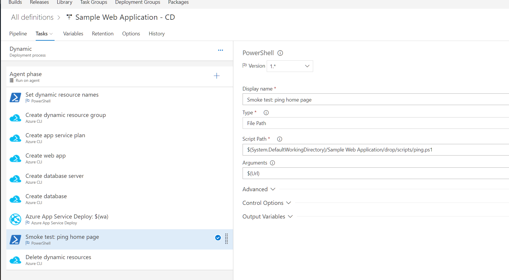
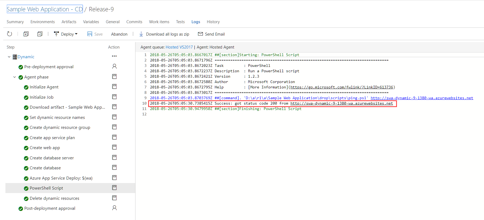

# Step By Step: Run quick smoke tests #

1. Create a feature branch in your repository by running `git checkout -b feature/add-smoke-test`
2. Add a script to your repository called `ping.ps1`, this is also attached to the workitem.
*for the rest of this step-by-step we will assume the path is `scripts\ping.ps1`
3. Add the following contents to the script:

```powershell
param($Url)

$result = Invoke-WebRequest -Uri $Url -Method Get

if($result.StatusCode -ne 200) {
    throw "Expected status code 200 but got $($result.StatusCode) from $($Url)"
}else{
    Write-Host "Success: got status code $($result.StatusCode) from $($Url)"
}
```

4. Commit and push the file to VSTS by running:
* `git add *` 
* `git commit -m "added ping script"`
* `git push -u origin feature/add-smoke-test`
5. Edit your CI build
6. add a copy files step right before the publish step:



7. configure it like this:



8. Edit the release you modified or created in for the previous PBI "FeatureBranchToDynamicEnvironment"
9. Edit the deploy web app task and add a variable to store the Url of the app service:



10. Add a powershell task right after you deploy web app task:



11. Configure it like this:



12. Queue a  release and verify the smoke test passes:

