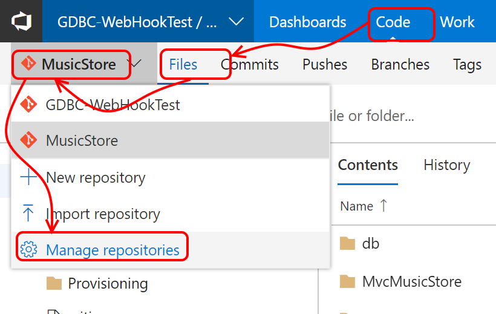
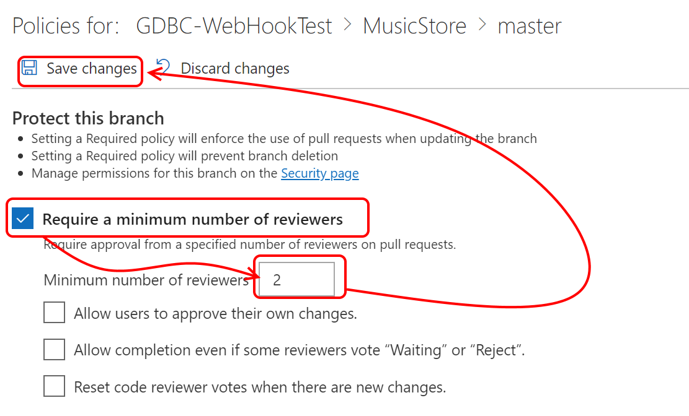

# Step by Step - Setup branch policies for code review #

1. Navigate to the code tab in your VSTS Project and make sure you are on the "Files" tab

2. Select the repository with the code for the GDBC-Website

3. Open the repository navigation and navigate to Manage repositories

4. On the Version Control Tab, expand the right repository

5. Expand the branch section and select the "master" branch

6. VSTS will navigate you to the policies page

7. Select the "Require a minimum number of reviewers" policy, and select number of reviewers.
8. Save the policy an test !

