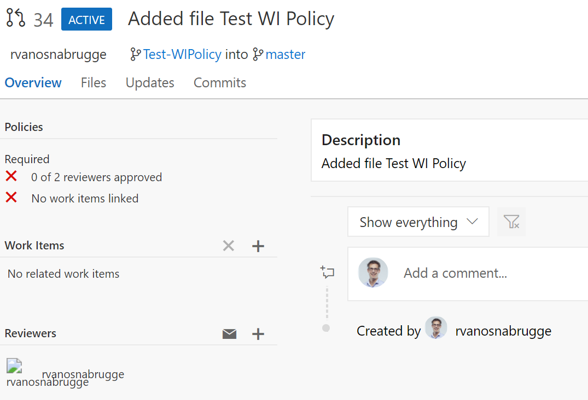

# Step by Step - Force traceability of work items #

1. Navigate to the code tab in your VSTS Project and make sure you are on the "Files" tab

2. Select the repository with the code for the MusicStore

3. Open the repository navigation and navigate to Manage repositories

4. On the Version Control Tab, expand the right repository

5. Expand the branch section and select the "master" branch

6. VSTS will navigate you to the policies page

7. Select the checkbox "Check for linked work items" and set the policy requirement to Required

8. Navigate to your code repository and create a new branch

9. Change or create a file and save and commit the changes to the repository
10. Create a Pull Request for this change to merge back into master. 
11. Open the Pull Request. You see that the policy is not fulfilled. No work items are linked

## Fix in Pull Request ##
1. Add a new Work Item by clicking the + sign next to work items and choose a work item

## Fix in Code Window ##
1.  Navigate to the code window
2. Make sure you selected the branch you just created
3. Make a new modification
4. Link work item when hitting Commit 

## Fix from the start ##
1. Open a work item
2. Click "create branch"

