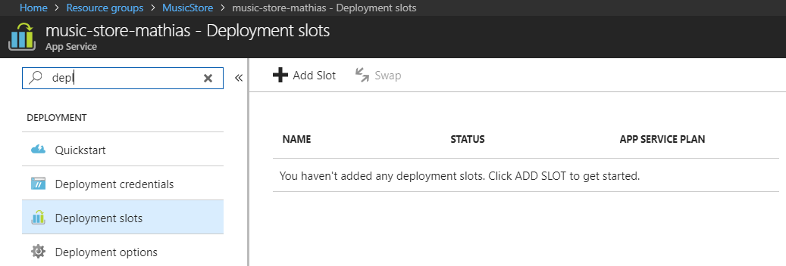
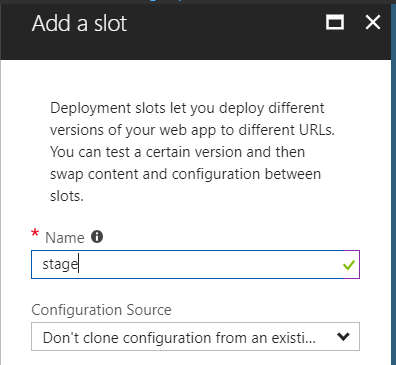
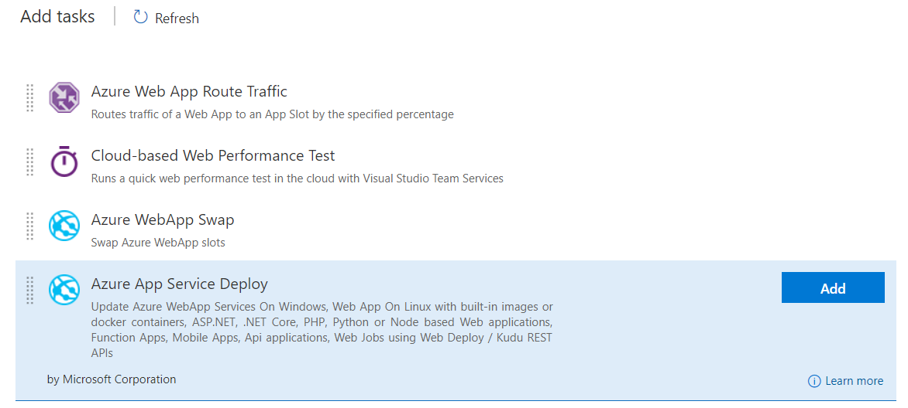
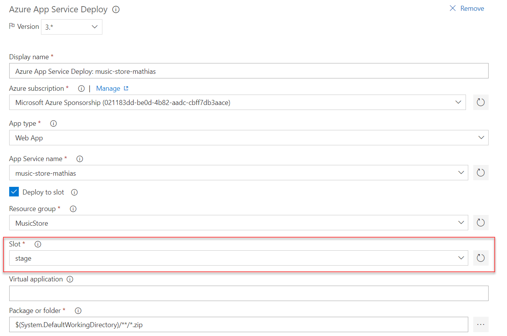

# Step by Step - Manually create a deployment slot in your web app and deploy to this #

## Configuring the Azure resource ##
1. Open the Azure Portal by navigating to [https://portal.azure.com](https://portal.azure.com)
2. Locate or create a web app for the application.
3. Select the Deployment slots option and add a new slot "stage".

4. Press Ok and wait for the slot to be created.

## Add deployment to web app slot ##
1. Open VSTS and navigate to the Build and Release hub.
2. Select releases and your release definition. 
3. Select the environment where you want to deploy your web app.
4. Select (or add) a Azure App Service Deploy step to the deployment process.

5.  Configure the deployment task to use the slot created earlier.

6. Queue a new release and deploy to the environment. Watch how the app gets deployed to the slot.
7. Navigate to the application and the stage slot by adding -stage to the name of the web app.
[https://yourwebapp-slot.azurewebsites.net](https://yourwebapp-slot.azurewebsites.net)