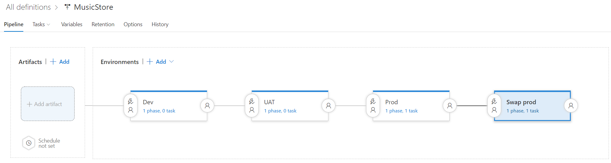
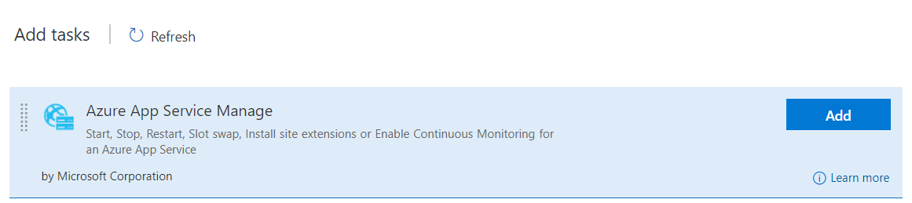
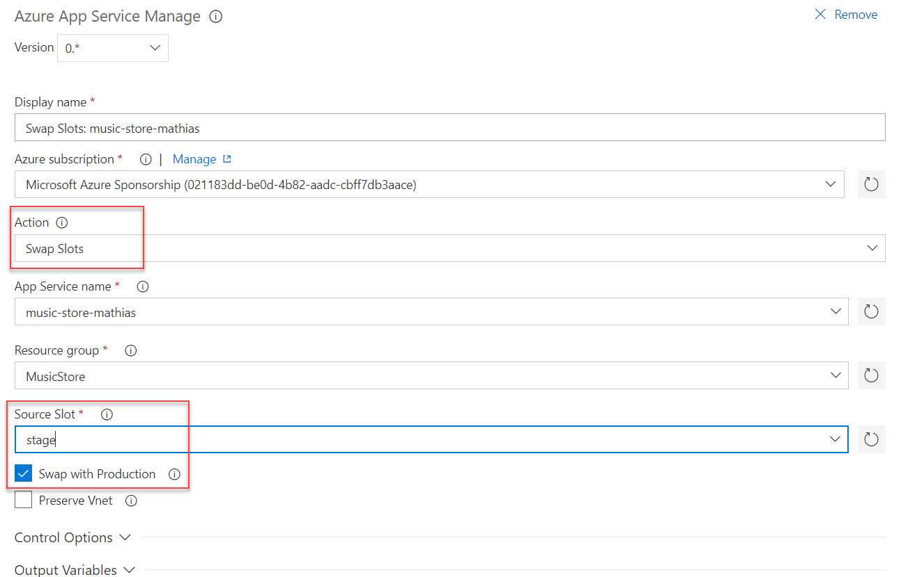

# Step by Step - Update your pipeline to swap slots when ready #

1. Open VSTS and navigate to the Build and Release hub.
2. Select Releases and your Release Definition. 
3. Add a new environment for swapping the stage slot to production

4. Add an Azure App Service Manage task.

5. Configure the deployment task to swap (action) using the desired source slot and swap that with production.

6. Queue a new release and deploy to the environment. Watch how the deployment slots are swapped.
7. Navigate to the application and verify that the version that used to be in the deployment slot now is live.
