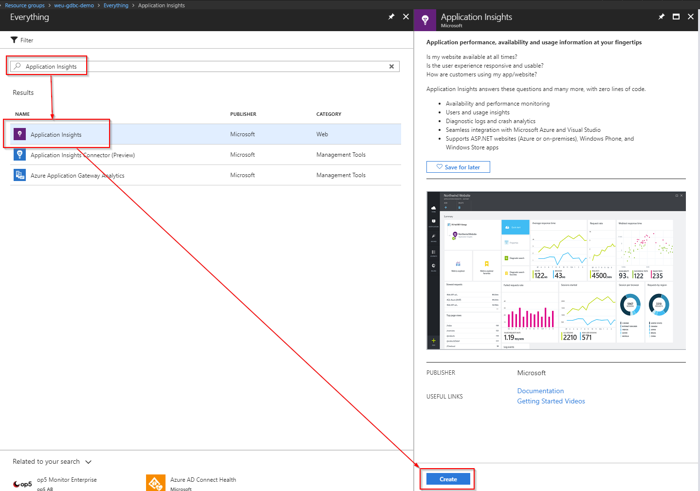
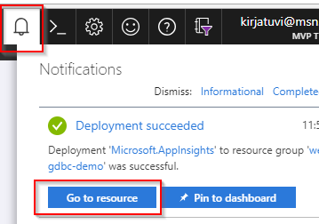
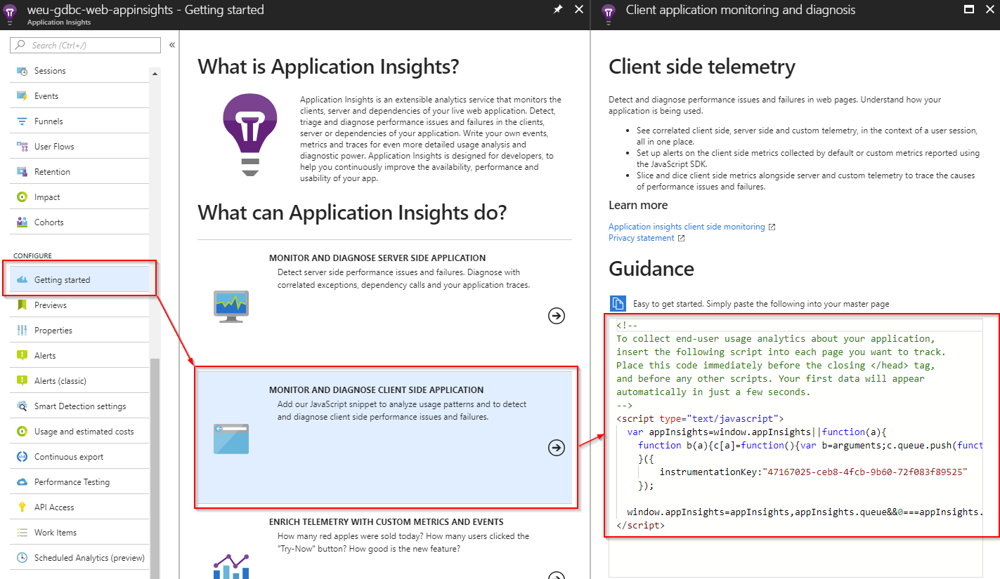

# Step By Step: Add App Insights to your WebApp #

1. Navigate to your [Azure Portal](http://portal.azure.com) and to the resource group containing the web app

1. Click _Add_ resource

   

1. To Filter type _Application Insights_, select _Application Insights_ and Click _Create_ 

   

1. Enter name for the resource (e.g. the sample uses weu-gdbc-web-appinsights), make sure _Application Type = ASP .NET Web Application_ and the rest of the values should default correctly when you started in the correct resource group. Click _Create_.

   

1. Once the new resource has been created, navigate to it

   

1. Generate the client site javascript code to add to your web application to start tracing usage analytics

   

1. Change your Shared\\_Layout.cshtml to include the application insights javascript code in it

**Note:** You can do this in web or locally

   

1. In the Visual Studio Quick Launch (CRTL+Q) search for the Add Appication Insights Telemetry 

    

1. Make sure you are using the latest Application Insights SDK to get the best experience and then press *Get Started*

   

1. Install the SDK and Register the existing application insights resource with the application

   

1. Commit the changes to repository.

1. Deploy your application with changed code and you should see usage information starting to come up in application insights telemetry when you navigate and use the website. Keep in mind it may take a few minutes.