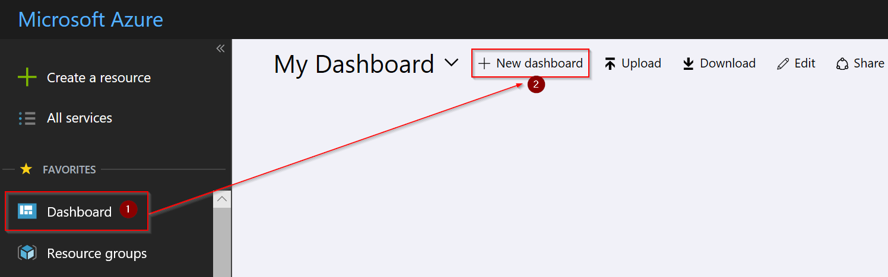
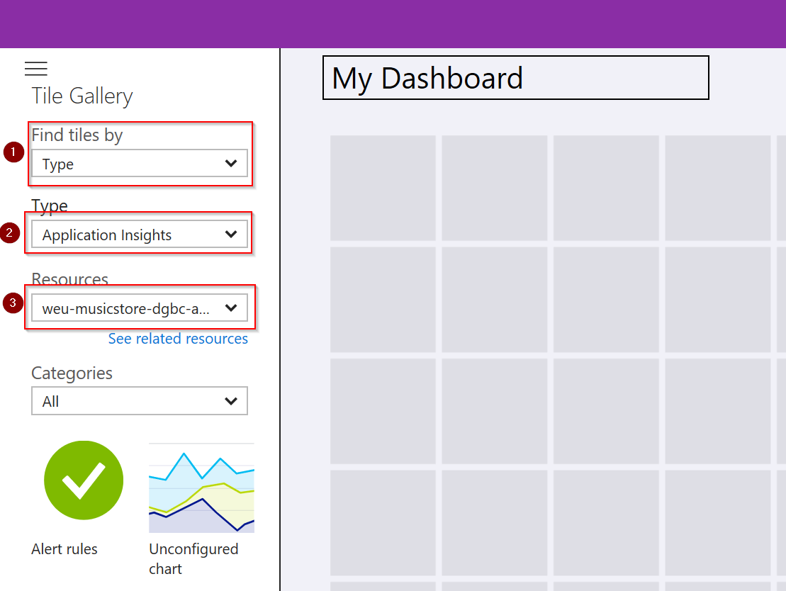
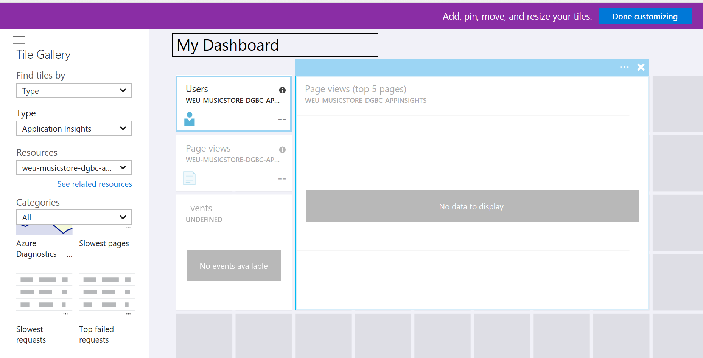
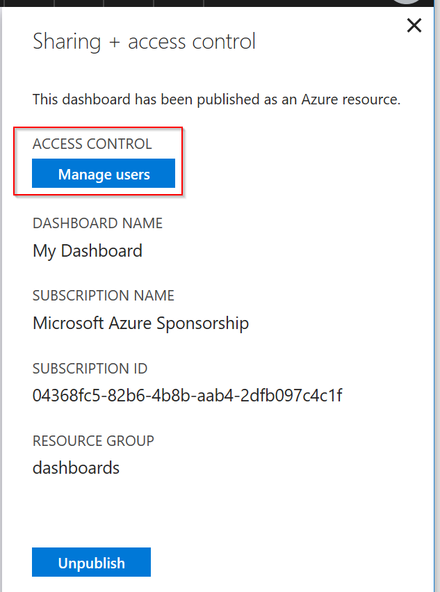

# Step By Step: Add Application Insights Usage Dashboard #

1. Login to [Azure Portal](https://portal.azure.com) 

   By default every azure portal has a dashboard. This dashboard can be private or public. You can create a new dashboard for GDBC Inc business which can later be published to the business side can use it to understand what is happening with the application.

2. Create a new dashboard by selecting _New dashboard_

   

3. The dashboard will be by default in editing mode and you can now add custom resource widgets to the dashboard. Easiest way to add application insights related widgets is to filter the widgets for application insights resource.

   

4. Now you can simply drag and drop different widget tiles to the canvas and position, configure and resize them. 
e.g. like below 

   

5. When you are happy and done with the dashboard, then you simply click the blue button **Done customizing**.

6. When you would like to share the dashboard with others, then click **Share** button and configure who should see this.

   

7. Once published, you can set Access Control rights on who can see this dashboard.

   