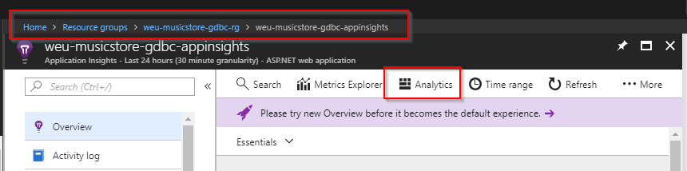
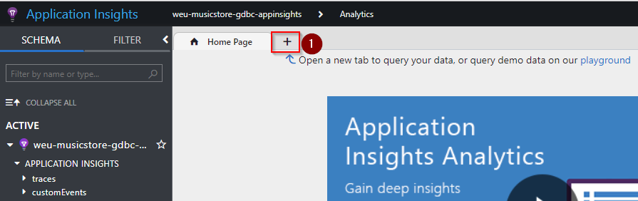
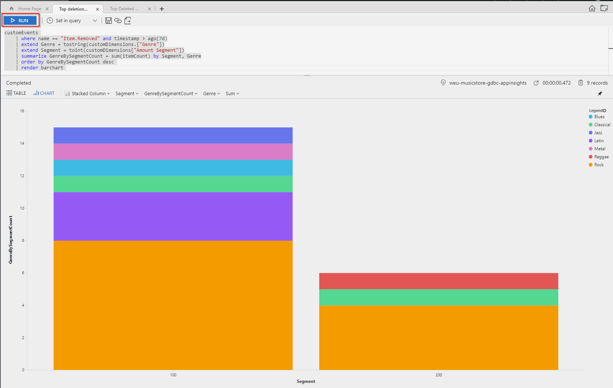
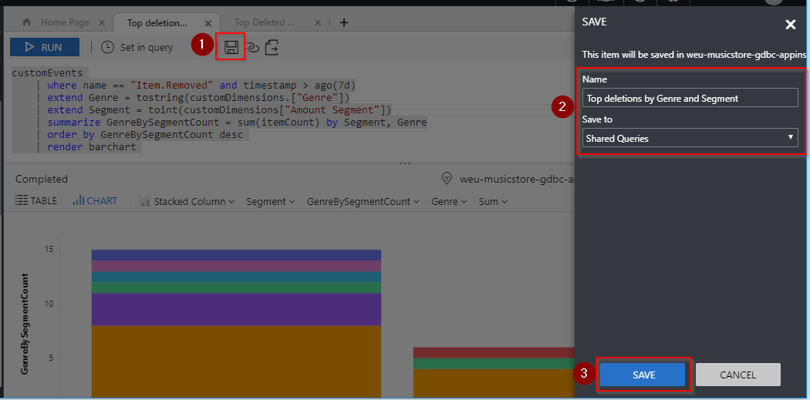
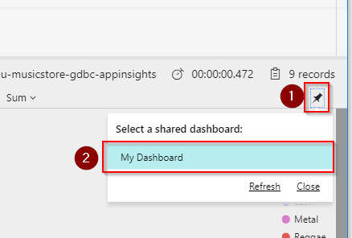
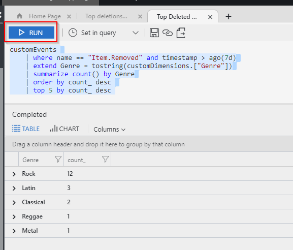
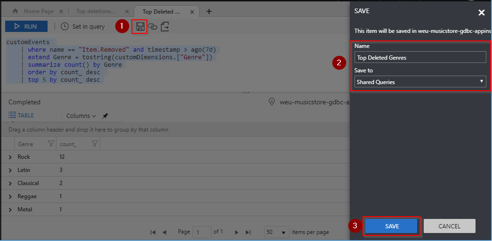
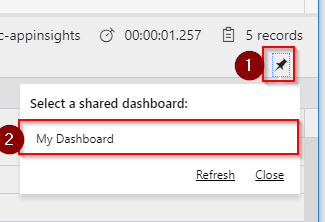

# Step By Step: Add telemetry to measure customer behaviour on deleting items in shopping basket #

To send more advanced custom events with metrics and measurements to application insights and show it on dashboard, you need to use the [application insights custom events and tracing apis](https://docs.microsoft.com/en-us/azure/application-insights/app-insights-api-custom-events-metrics#trackevent).

## Add custom event with metrics ##

1. Open the **ShoppingCartController** class and navigate to the **RemoveFromCart** method. We need to add custom tracing logic into this class that would collect and record down these extra details required by out business.

   To do that we need some helper methods in the controller. Copy to the end of the class the following code.

   ```csharp
   private void LogTelemetryEvent(ShoppingCart cart, Album album)
   {
       var basketValue = GetShoppingbasketTotalRange(cart);
       TelemetryClient client = new TelemetryClient();
       var properties = new Dictionary<string, string>();
       properties.Add("Amount Segment", GetShoppingbasketTotalRangeSegment(basketValue).ToString());
       properties.Add("Genre", album.Genre.Name);
       properties.Add("Artist Name", album.Artist.Name);
       var measurements = new Dictionary<string, double>();
       measurements.Add("Total Amount", basketValue);
   
       client.TrackEvent("Item.Removed", properties, measurements);
   }
   
   private double GetShoppingbasketTotalRange(ShoppingCart cart)
   {
       return Convert.ToDouble(cart.GetTotal());
   }
   
   private double GetShoppingbasketTotalRangeSegment(double basketValue)
   {
       if (basketValue < 100)
           return 100;
       if (basketValue >= 100 && basketValue <= 200)
           return 200;
       if (basketValue > 200 && basketValue <= 500)
           return 500;
       return 1000;
   }
   ```

   And then add the call to **LogTelemetryEvent** from **RemoveFromCart** method.

   ```csharp
   [HttpPost]
   public ActionResult RemoveFromCart(int id)
   {
   
       ...
   
       int itemCount = cart.RemoveFromCart(id);
   
       // log telemetry data to understand when people remove items from the basket
       LogTelemetryEvent(cart, album); 
   
       // Display the confirmation message
       var results = new ShoppingCartRemoveViewModel
       {
           Message = Server.HtmlEncode(album.Title) +
               " has been removed from your shopping cart.",
           CartTotal = cart.GetTotal(),
           CartCount = cart.GetCount(),
           ItemCount = itemCount,
           DeleteId = id
       };
       return Json(results);
   }
   ```

2. Commit the changes, push the changes and wait for your build and release to finish to deploy the new application with extra custom event metrics. If you would like to see that its working right now, then you can also debug it locally and see information being sent to azure. 

## Customize dashboard to show the details ##

To fulfil the following acceptance criteria's, we need to create two new dashboard information widgets. There are several ways to do this (Analytics portal, workbooks, etc), but in the step-by-step we have chosen to use Analytics and show the results on azure dashboard.

1. To go to Analytics related to your Application Insights you have to **navigate to the application insights resource** and click **Analytics**.    

   

#### On the app insights dashboard there is a graph that shows the genre and amount bucket of deleted records

1. Once the Analytics portal is open. Open a new query tab. 

   

2. Now Copy the following query into it, that will query Genre and Segment information from customEvents custom dimensions and show its a graphical way per segments.

   ```bash
   customEvents 
       | where name == "Item.Removed" and timestamp > ago(7d)
       | extend Genre = tostring(customDimensions.["Genre"])
       | extend Segment = toint(customDimensions["Amount Segment"])
       | summarize GenreBySegmentCount = sum(itemCount) by Segment, Genre
       | order by GenreBySegmentCount desc 
       | render barchart 
   ```

3. Run the query

   

4. Save the query in shared queries listing

   

5. Pin it to Azure Dashboard

   

6. Now go have a look at your Azure Dashboard, it should have a new widget with the bar chart

#### On the app insights dashboard there is a table that shows the top 5 genres that get deleted

1. Once the Analytics portal is open. Open a new query tab. 

   

2. Now Copy the following query into it, that will query Genre and Segment information from customEvents custom dimensions and show its a graphical way per segments.

   ```bash
   customEvents 
       | where name == "Item.Removed" and timestamp > ago(7d)
       | extend Genre = tostring(customDimensions.["Genre"])
       | summarize count() by Genre
       | order by count_ desc 
       | top 5 by count_ desc 
   ```

3. Run the query

   

4. Save the query in shared queries listing

   

5. Pin it to Azure Dashboard

   

6. Now go have a look at your Azure Dashboard, it should have a new widget with the table