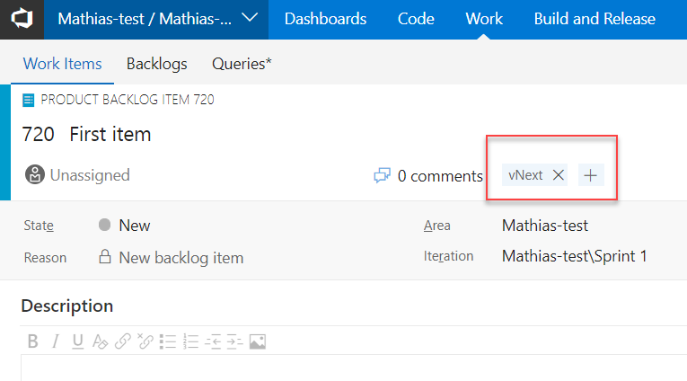
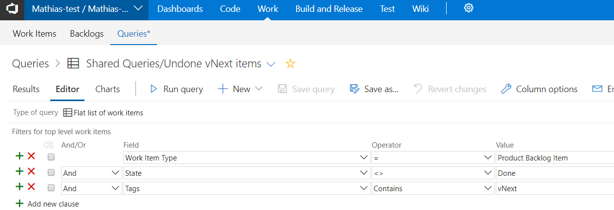
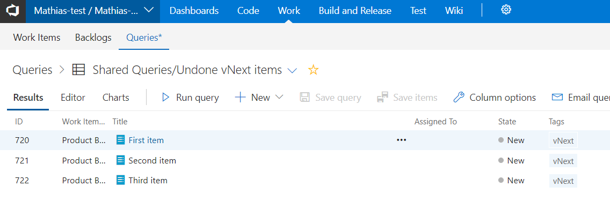

# Step by Step - Add a Release Gate for Completed Work #

1. Navigate to the Work hub in your VSTS project and select the Work Items tab.

2. Create three work items and tag them with "vNext".

3. Navigate to the Queries tab. Create a new query that filters for all undone work items with the tag "vNext". Make sure to save it as a team or shared query or it will not be accessible from the release gate configuration later. 

    > Make sure to save the query as Shared Query

4. If you run the query the result should look something like this

5. Go to the Releases hub and and select Releases. Edit the release definition that deploys your application.

6. Open the pre-deployment conditions for the _Prod_ environment and enable the Gates feature.

7. Add a Query Work Items gate and configure it to use the query created in the previous step. Leave threshold values to 0 and set Delay before evaluation to 0 and Time between re-evaluation of gates to 5 minutes.

8. Create a release and deploy to prod. Watch how it waits for work items to change state.

9. Update the work items to Done and watch how the gate will open and start the deployment to prod. 

