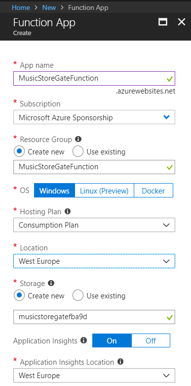
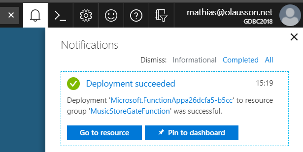
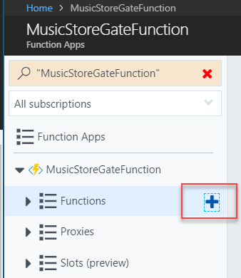
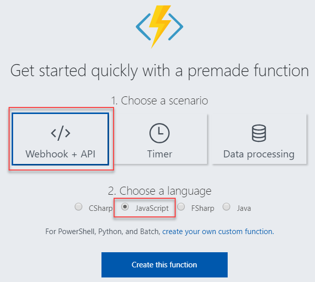
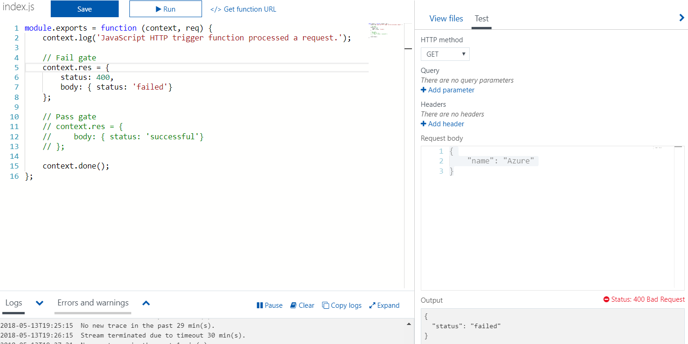

# Step by Step - Create an Azure function #

1. Sign in to the Azure portal at [http://portal.azure.com](http://portal.azure.com) with your Azure account.

1. Select the _Create a resource_ button found on the upper left-hand corner of the Azure portal, then select _Compute > Function App_.

3. Use the function app settings as specified in the the image below. 

**Note:** Make sure to select a unique name.



4. Select Create to provision and deploy the function app. 

5. Select the Notification icon in the upper-right corner of the portal and watch for the Deployment succeeded message.



6. Select _Go to resource_ to view your new function app.

7. Expand your new function app, then click the + button next to Functions.



8. In the Get started quickly page, select _WebHook + API_, Choose _JavaScript_ as the language for your function, and click _Create this function_.



9. Update the code to return either success or failure. The code can also be found in workitem attachment called _AzureFunction.js_

```javascript
module.exports = function (context, data) {
    context.log('Webhook was triggered!');

    // Fail gate
    context.res = {
        status: 400,
        body: { status: 'failed'}
    };

    // Pass gate
    // context.res = {
    //     body: { status: 'successful'}
    // };

    context.done();
}
```

10. Test the function over HTTP GET using the Run button in the editor. Make sure the output is either failed or successful depending on which code block you have commented out.


