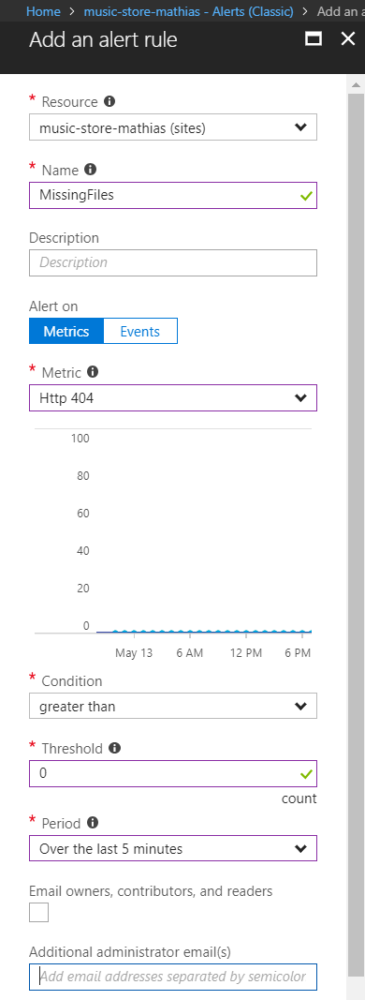
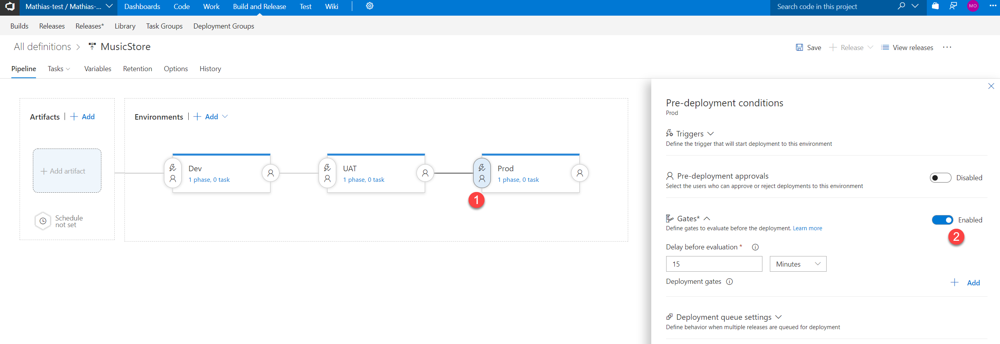
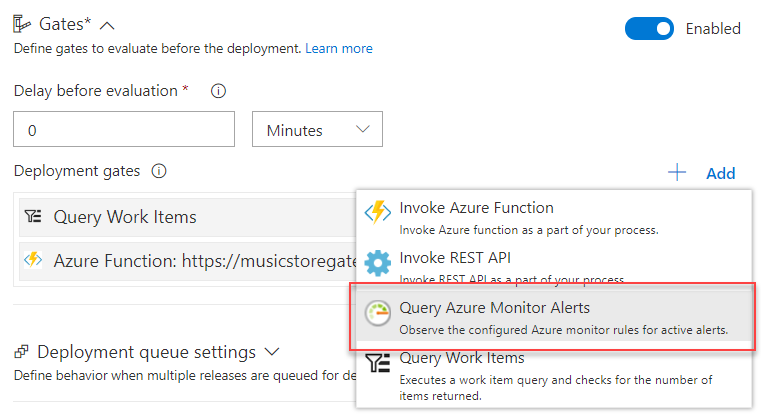
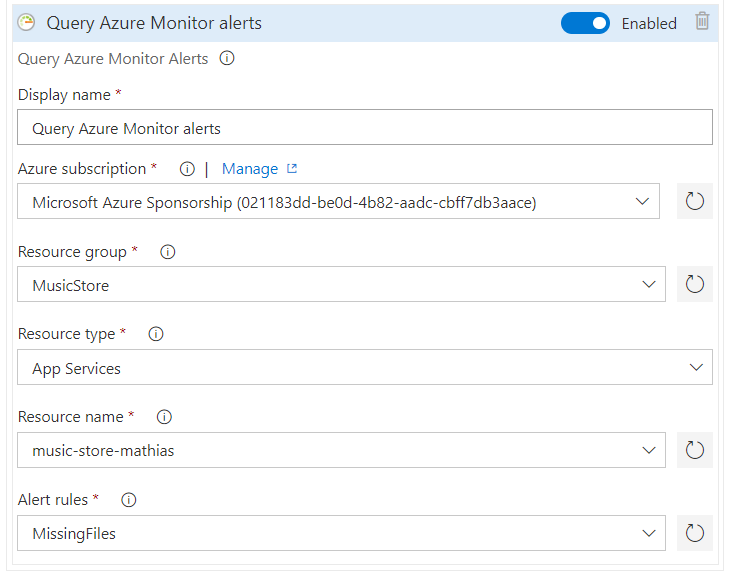
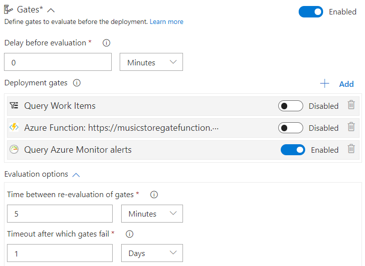
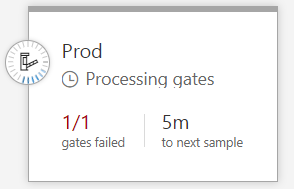
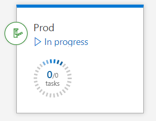

# Step by Step - Add a Release gate on app performance #

1. Sign in to the Azure portal at [http://portal.azure.com](http://portal.azure.com) with your Azure account.

2. Go to the MusicStore resource group and select the client web app.

3. Select the Monitoring/Alerts (classic) tool and add an alert.

4. Create an alert that triggers on missing files (HTTP 404) using the following configuration:

> Note that you select your Application as Resource

5. Navigate to the Build and Release hub in your VSTS project and select the Releases tab.

6. Open the pre-deployment conditions for the Prod environment and enable the Gates feature if it isn't already enabled from an earlier challenge.

7. Add a Query Azure Monitor Alerts gate and configure it to use the Azure Alert created earlier. 

8. Configure the gate with the parameters from the Azure Alert. You may need to Authorize the Azure subscription if it hasn't already been added to the VSTS account.

9. Set Delay before evaluation to 0 and Time between re-evaluation of gates to 5 minutes.

10. Navigate to a page in the Music store that doesn't exist. This will give a 404 return code which triggers the Azure alert.

11. Create a release and deploy to prod. Watch how it checks the Azure alert and get an failed result back.

12. Wait for some time. The Azure alert will reset after 5 minutes and after that the deployment gate will pass. So after 5-10 minutes the gate will open when it gets a successful result back from the alert and start the deployment to prod. 

