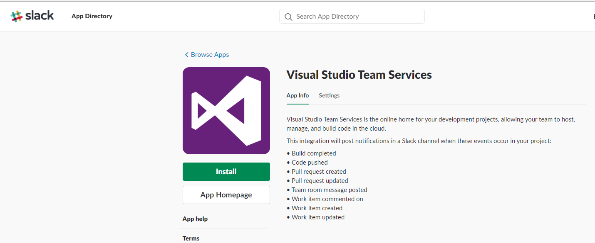
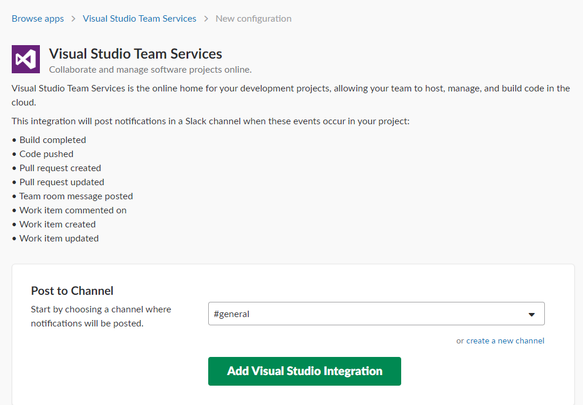
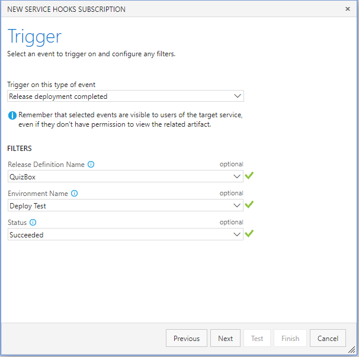

# Step By Step: Post message to Slack for each new release #

1. From any page on your team's Slack (https://[team].slack.com/...), click your account name in the left window pane to open up the menu, and find *Manage Apps* in the :Administration menu 

2. Search for *Visual Studio Team Service* and press *Install*

2. Select the channel that you want to post to, and then *Add Visual Studio Integration*

3. Follow the setup instructions that is shown when the integration has been created. 

4. When creating the Slack service hook, select the* Release deployment completed* event, and select the corresponding release definition and environment

5. Save the service hook, and queue a new release. Verify that a message is posted once the release has successfully completed the environment that you configured in the previous step

