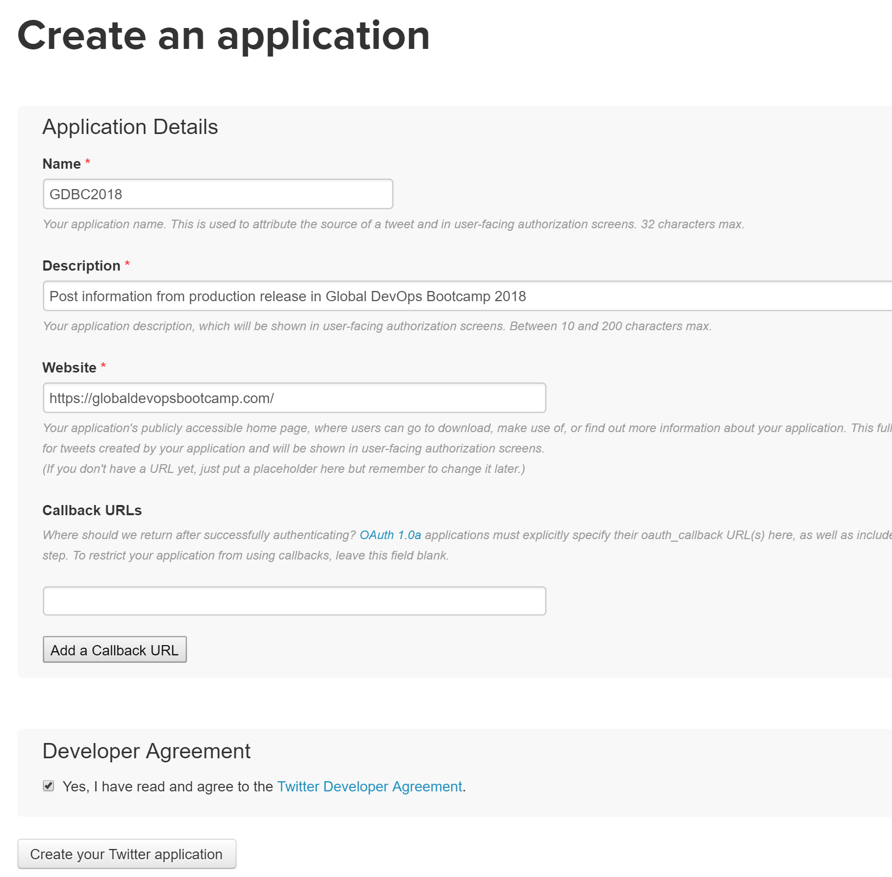
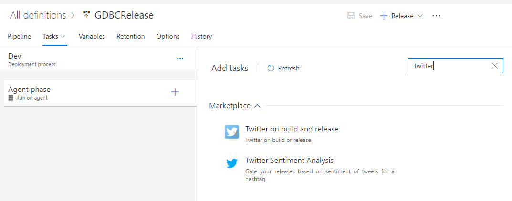
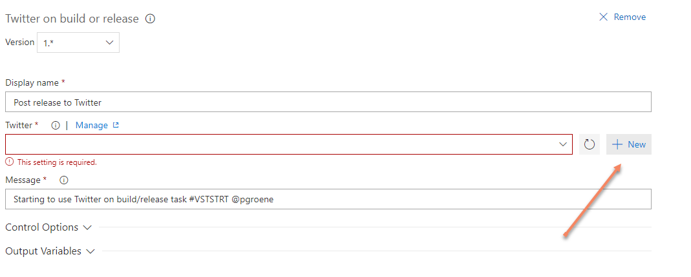
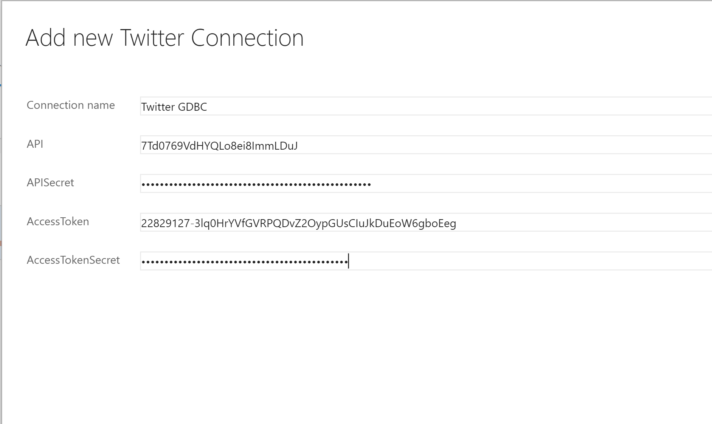

# Step By Step: Post message to Slack for each new release #

1. Go to https://apps.twitter.com and register a new app and get an access token to be used later in the release task

2. When the application is created, generate access token

3. In the production environment of the release definition, select add task and search for Twitter

4. Select *Get it free* and follow the instructions to install the extension to your VSTS account

5. Add the twitter task and press *+New* to create a new Twitter service connection

6. Enter the information from your twitter app registration: 

* API = Consumer Key (API Key)
* APISecret = Consumer Secret (API Secret)
* AccessToken = Access Token
* AccessTokenSecret = Access Token Secret

7. Save the release definition and queue a new release

8. Verify that your release definition now posts to Twitter 
