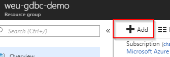
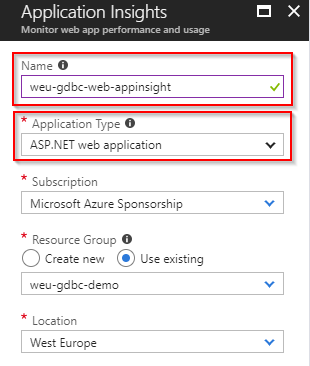
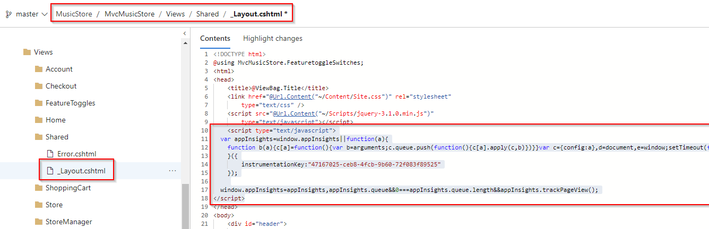
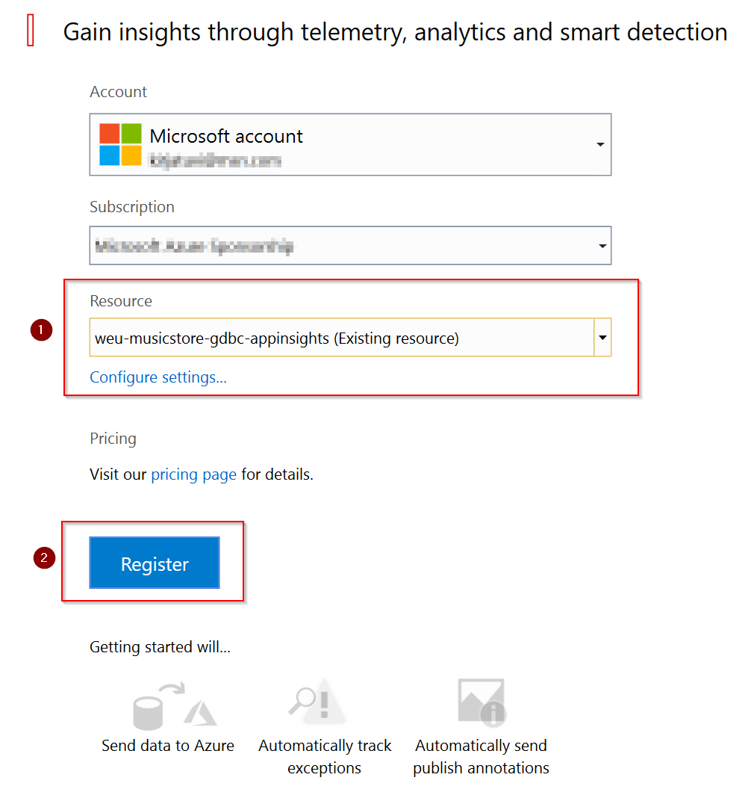
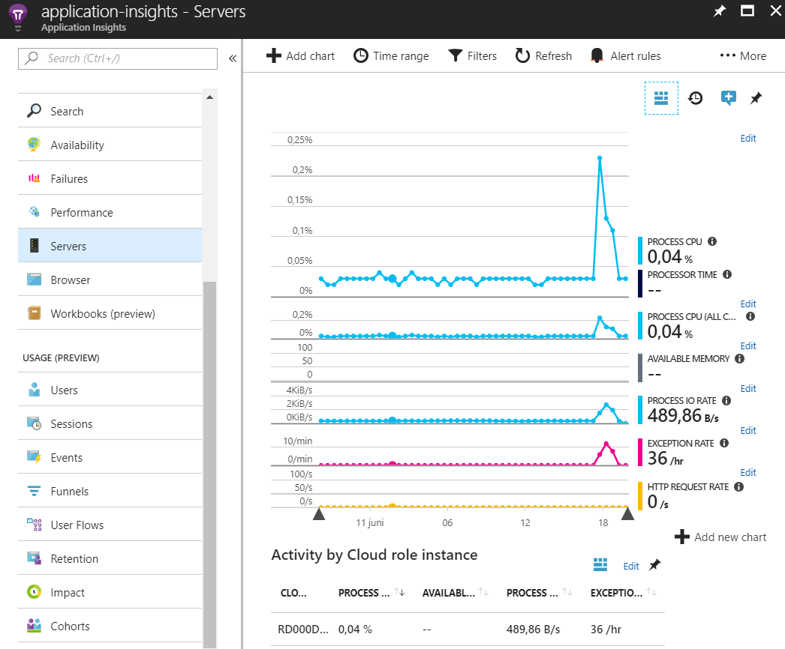
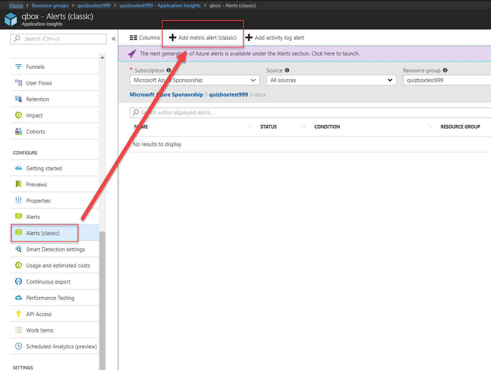
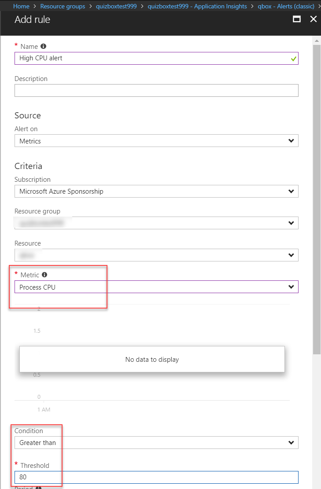
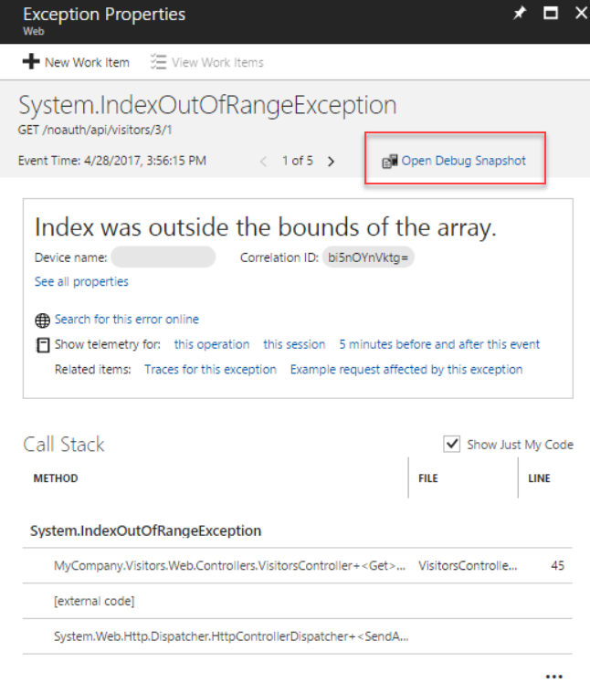

# Step By Step: Add Application Insights to catch performance and diagnostics #

## Setup Application Insights ##

1. Navigate to your [Azure Portal](http://portal.azure.com) and to the resource group containing the web app

1. Click _Add_ resource

   

1. To Filter type _Application Insights_, select _Application Insights_ and Click _Create_ 

   

1. Enter name for the resource (e.g. the sample uses weu-gdbc-web-appinsights), make sure _Application Type = ASP .NET Web Application_ and the rest of the values should default correctly when you started in the correct resource group. Click _Create_.

   

1. Once the new resource has been created, navigate to it

   

1. Generate the client site javascript code to add to your web application to start tracing usage analytics

   

1. Change your Shared Layout.cshtml to include the application insights javascript code in it

**Note:** You can do this in web or locally

   

1. In the Visual Studio Quick Launch (CRTL+Q) search for the Add Appication Insights Telemetry 

    

1. Make sure you are using the latest Application Insights SDK to get the best experience and then press *Get Started*

   

1. Install the SDK and Register the existing application insights resource with the application

   

1. Commit the changes to repository.

1. Deploy your application with changed code and you should see usage information starting to come up in application insights telemetry when you navigate and use the website. Keep in mind it may take a few minutes.

## Live Metrics ##

1. In the Azure portal, open the Application Insights resource for your app, and then open Live Stream.

2. Select and filter your metrics. You can monitor custom KPI live by applying arbitrary filters on any Application Insights telemetry from the portal. Click the filter control that shows when you mouse-over any of the charts.

    

3. You can monitor a value different from Count. The options depend on the type of stream, which could be any Application Insights telemetry: requests, dependencies, exceptions, traces, events, or metrics.

    

4. Configure custom Live Diagnostic Events. By default, the live feed of events shows samples of failed requests and dependency calls, exceptions, events, and traces. Click the filter icon to see the applied criteria at any point in time. 

    

5. The first time you want to filter Application Insights will prompt you to setup an authenticated channel to avoid sending sensitive data.

    

5. See the details of an item in the live feed by clicking it. You can pause the feed either by clicking Pause or simply scrolling down, or clicking an item. 

    

6. If you want to monitor a particular server role instance, you can filter by server.

    

## ##
Windows provides a wide variety of performance counters such as CPU occupancy, memory, disk, and network usage. You can also define your own. Application Insights can show these performance counters if your application is running under IIS on an on-premises host or virtual machine to which you have administrative access. The charts indicate the resources available to your live application, and can help to identify unbalanced load between server instances.

1. In the Azure portal, open the Application Insights resource for your app and click on Servers.

    

2. The Servers blade shows a default set of performance counters. To see other counters, either edit the charts on the Servers blade, or open a new Metrics Explorer blade and add new charts. The available counters are listed as metrics when you edit a chart.

    

## Alerts ##

Metric alerts tell you when a metric crosses a threshold value for some period - such as response times, exception counts, CPU usage, or page views. Let's setup an alert to monitor request performance. 

1. In the Azure portal, open the Application Insights resource for your app and click on Alerts.

2. Use the add button to create an Alert

    

3. Next add a Metrics alert for CPU > 80%

    

4. There are lots of other types of Alerts so explore the options for both classical and new Alerts!

## Smart Detection ##
Smart Detection automatically warns you of potential performance problems in your web application. It performs proactive analysis of the telemetry that your app sends to Application Insights. If there is a sudden rise in failure rates, or abnormal patterns in client or server performance, you get an alert. This feature needs no configuration. It operates if your application sends enough telemetry.

1. In the Azure portal, open the Application Insights resource for your app.

2. Explore the smart detection feature in Azure Application Insights by clicking on the Smart Detection icon or menu item.

    

## Snapshot Debugger ##
When an exception occurs, you can automatically collect a debug snapshot from your live web application. The snapshot shows the state of source code and variables at the moment the exception was thrown. The Snapshot Debugger (preview) in Azure Application Insights monitors exception telemetry from your web app. It collects snapshots on your top-throwing exceptions so that you have the information you need to diagnose issues in production.

1. Enable Application Insights in your web app, if you haven't done it yet.

2. Include the Microsoft.ApplicationInsights.SnapshotCollector NuGet package in your app.

3. Review the default options that the package added to ApplicationInsights.config:

4. Snapshots are collected only on exceptions that are reported to Application Insights. In some cases (for example, older versions of the .NET platform), you might need to configure exception collection to see exceptions with snapshots in the portal

5. Owners of the Azure subscription can inspect snapshots. Other users must be granted permission by an owner. To grant permission, assign the Application Insights Snapshot Debugger role to users who will inspect snapshots. This role can be assigned to individual users or groups by subscription owners for the target Application Insights resource or its resource group or subscription.

6. Debug snapshots in the Application Insights portal. If a snapshot is available for a given exception or a problem ID, an Open Debug Snapshot button appears on the exception in the Application Insights portal.

    

7. In the Debug Snapshot view, you see a call stack and a variables pane. When you select frames of the call stack in the call stack pane, you can view local variables and parameters for that function call in the variables pane.

    
