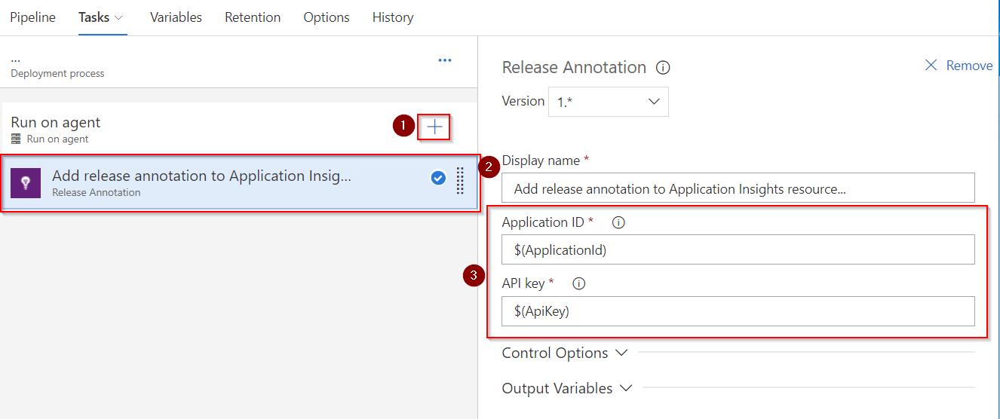
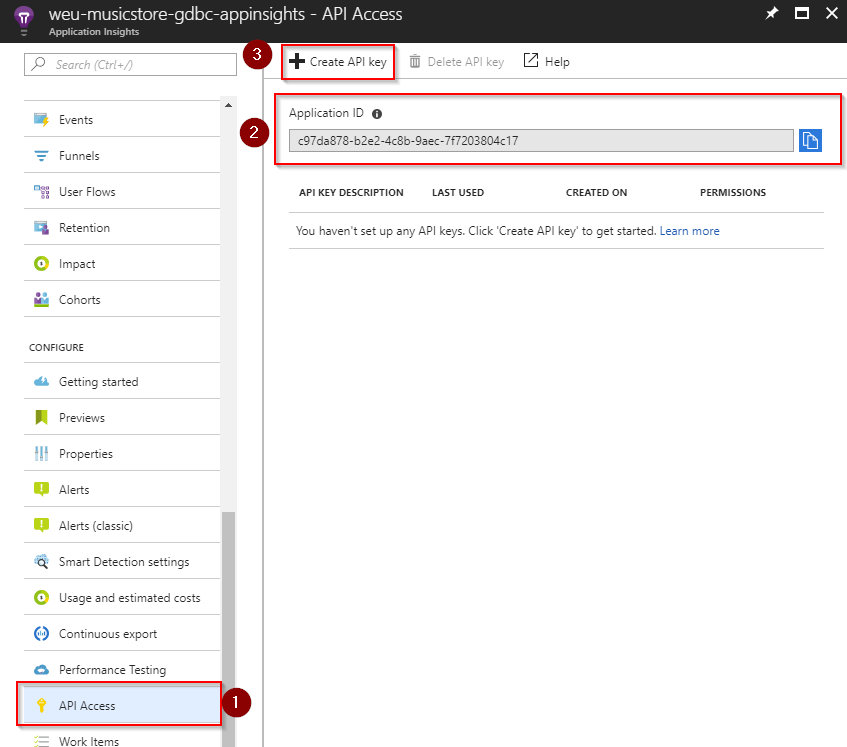
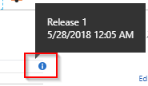

# Step By Step: Add Release Annotations to your pipeline to show when a release has been done #

The following Step by Step helps you enable Release Annotations from your release pipeline. 
To use release annotations from release pipeline you need to have [Release Annotations for Azure Application Insights](https://marketplace.visualstudio.com/items?itemName=ms-appinsights.appinsightsreleaseannotations) installed on your VSTS / TFS collection and you need to have an application insights resource in azure. This step by step assumes that both of these conditions are fulfilled.

1. Navigate to your release pipeline and open the release definition. Add a new task into the pipeline after the application deployment steps.

   

   **NB!** I have configured **ApplicationId** and **ApiKey** variables in the pipeline. Please create them as well. These hold the values for this environments application insights api key and application id and the following section will show where to find them. 

2. You will find the application id and can create the api key by opening application insights resource in azure portal and navigating to **Configure -> API Access**

   

   - Copy the application id and store it in the variable **ApplicationId** in your release pipeline.

   - Click **Create API key** to create the api key that the release pipeline task can use to create release annotations.

   

   **NB!** Once the api key is generated, it will only be shown to you once. Make sure to store this away in the variable **ApiKey** in the pipeline and perhaps also in another secure location. 

3. Now that you have the ApplicationId and ApiKey variables configured in the release pipeline, you should be able to run the release and it would create release annotations. An easy way to confirm that release annotations are created is to look at the **Metrics Explorer** view in application insights resource. You are looking for a small blue i marker. 

   
