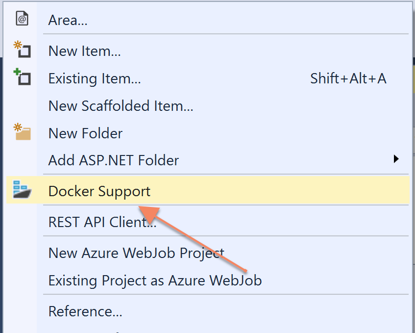

# Step By Step: Create a Docker container for the Web application #

1. Open the MvcMusicStore solution in Visual Studio 2017 

2. Right-click the MvcMusicStore project and select Add -> Docker Support:

 

3. A Dockerfile should be added to the project. In addition, a new project called **docker-compose** is added with one yml file in it. This project should be selected as startup project.

4. Run the application. The first time, the base image (*microsoft/aspnet:4.7.1-windowsservercore-1709*) will be downloaded from Docker Hub, which could take several minutes. Once that is done, the web appliation should start inside the container and Visual Studio should show a browser pointing to the IP address of the running container

5. Now, since the web application is dependent on the database, it will fail when it tries to connect to the database. This is expected, and you will add support for running the database inside a container in another challenge

6. Verify that the application is running in a container by running the following command in a command or PowerShell window. 

**docker ps**

7. You can see the container image that has been built by opening a command prompt and run **docker images**, which will list all docker images on your machine You should see the mvcmusicstore image in the list with a **dev** tag. This is the result of the Debug build in Visual Studio. This image is not intended for pushing to a regsitry

8. Switch to the **Release** configuration in Visual Studio and compile the solution again. When it has completed, run **docker images** again. Now you should also have a **mvcmusicstore:latest** image, which is a production ready image
