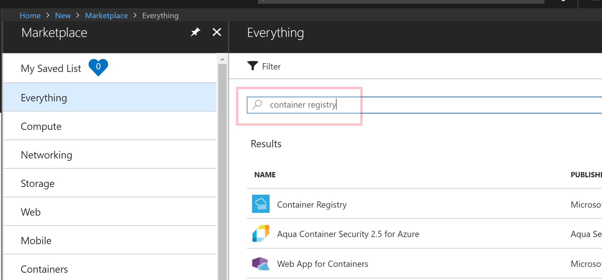
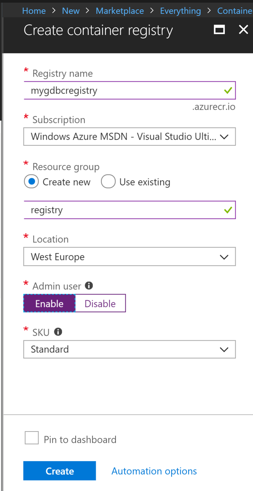
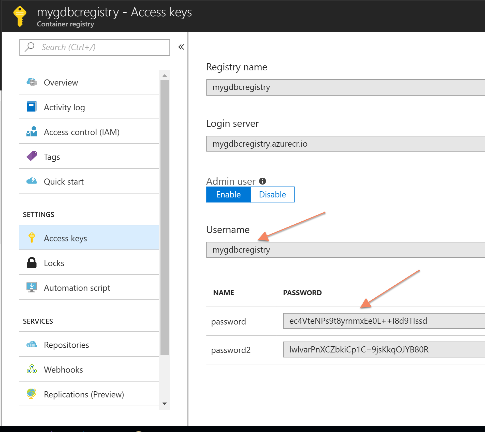

# Step By Step: Setup an Azure Container Registry #

1. In the Azure Portal, select **Create resource** and search for *Container Registry* 

 

2. Enter a name for the registry, and for the resource group. Also enable the **Admin user**

 

3. Press create and wait for it to finish

4. Browse to the registry and select the **Access keys** tab and note the user name and password you will use later to connect to the registry:

 

5. Open a command prompt and run the following command to connect to the newly created container registry. 

` docker login <registryname>.azurecr.io -u <username> -p <password> `

6. Congratulations, you now a registry that you can push your container images to