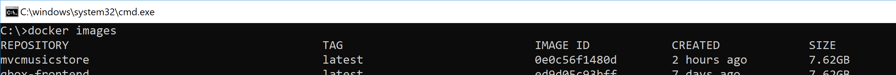
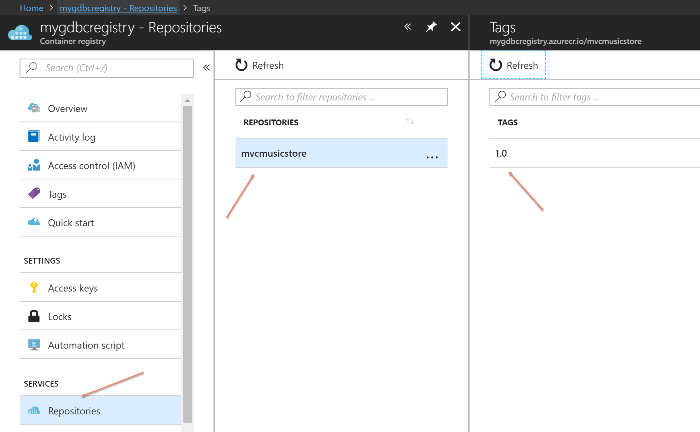

# Step By Step: Publish development image to Azure Container Registry #

1. In Visual Studio 2017, compile the docker-compose project in **Release** configuration. 

2. When the compilation is done, verify that the image for MvcMusicStore has been created by running **docker images** in a command prompt

3. You should see an image that was just created called *mvcmusicstore* with the tag *latest* 

 

4. Tag the image by running the following command, replacing <registryname> with the name of your container registry:

` docker tag mvcmusicstore:latest <registryname>.azurecr.io/mvcmusicstore:1.0 `

5. Push the image to the container registry by running the following command:

` docker push <registryname>.azurecr.io/mvcmusicstore:1.0 `

6. The first time, this will take a while. The nest time you push an updated image, it will be much faster since only the changes will be pushed

5. Also push the DB image that you created before:

` docker push <registryname>.azurecr.io/mvcmusicstoredb:1.0 `

7. You can view the content of your container registry in the Azure portal. Browse to the container registry and select the *Repositories* tab

 
